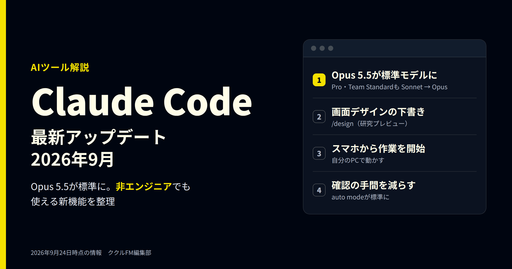
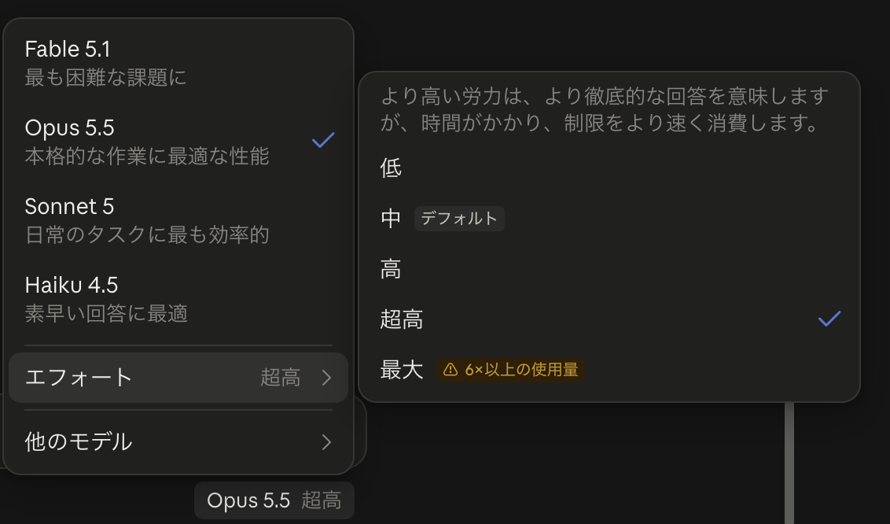
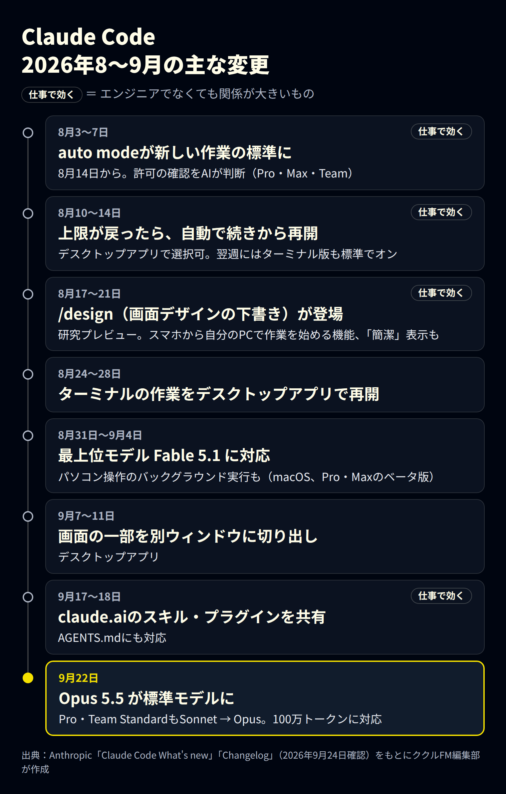
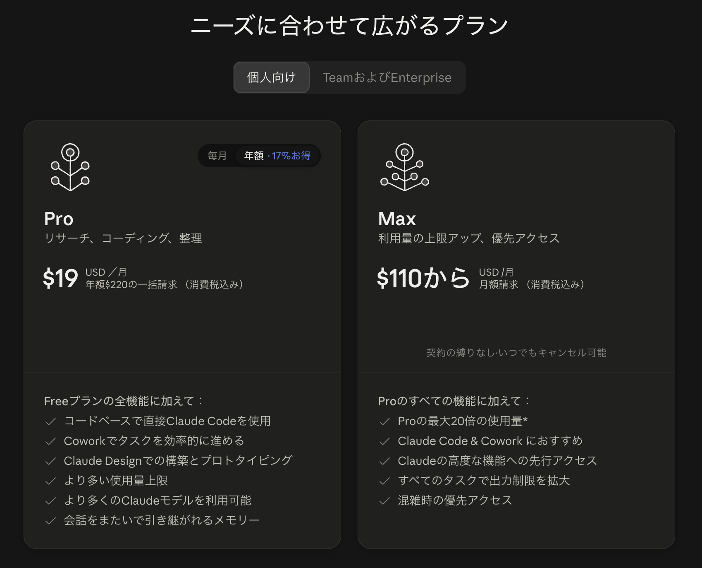
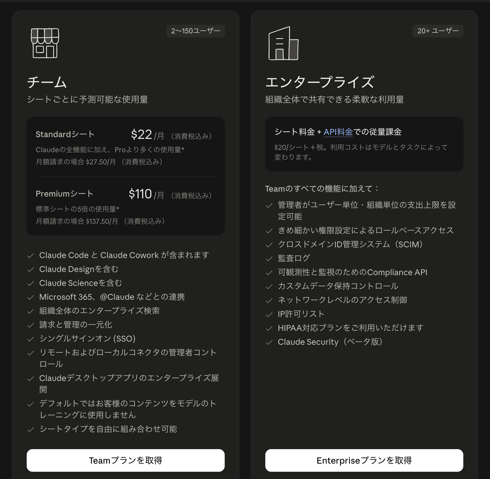
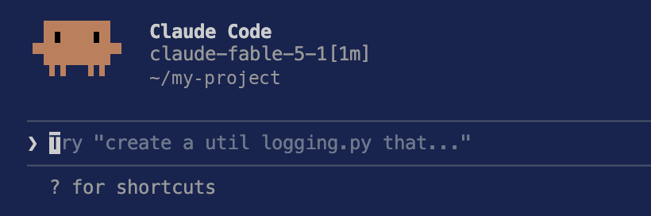

# Claude Codeの最新アップデート（2026年9月）｜Opus 5.5と非エンジニアにも使える新機能

**公開日**: 2026.09.24  
**カテゴリ**: AIツール  
**著者**: ククルFM編集部  
**概要**: 2026年9月22日、Claude Codeの標準モデルがOpus 5.5になりました。8〜9月の主な変更を年表で整理し、画面デザインの下書きやスマホからの操作など、エンジニアでなくても仕事で使える新機能と、料金・注意点を解説します。

---

Anthropic（アンソロピック）の「Claude Code（クロード・コード）」は、AIに指示を出して、Webページや社内ツールなどのファイルを作ったり直したりしてもらうツールです。2026年9月22日に新しいモデル「Opus 5.5」が標準になりました。8〜9月には、エンジニアでなくても使いやすくなる機能もいくつか追加されています。

この記事では、9月時点の最新情報と8〜9月の主な変更、エンジニアでなくても使える機能、料金、注意点を整理します。情報は2026年9月24日時点です。更新は週単位で続いているため、使う前に公式の情報も確認してください。

※本記事はAI（Claude）の支援を受けて作成し、内容は編集部がAnthropicの公式情報と照らし合わせて確認しています。

## 先に結論：9月の変化は3つ

- **標準モデルがOpus 5.5に**：9月22日から。個人向けのProプランと、Teamプランの標準シート（Standard）も、標準がSonnetからOpusに変わりました
- **目で見て確かめられる機能が増えた**：画面デザインの下書き（/design）、スマホからの操作、利用上限が戻ったあとの自動再開など
- **確認の手間が減った**：操作の許可をAIが判断する「auto mode」が標準になりました。ただし、任せきりにはできません

## Claude Codeとは：ターミナル以外でも使えるようになった

Claude Codeは、もともと「ターミナル」（文字でパソコンに命令する画面）で使うエンジニア向けのツールでした。今は次の場所から使えます。

| 使う場所 | 特徴 | 向いている人 |
|---|---|---|
| デスクトップアプリ（Codeタブ） | ボタンや画面で操作できる。ターミナルは不要 | エンジニアではない人、はじめての人 |
| ターミナル | 新しい機能が最初に入る | エンジニア、細かく設定したい人 |
| VS Codeなどの編集ソフト | ファイルを見ながら指示できる | 普段から編集ソフトを使う人 |
| スマホ・Web | 外出先から指示や確認ができる | 作業の続きを外で見たい人 |

デスクトップアプリには「Chat」「Cowork」「Code」の3つのタブがあります。資料の整理などの事務作業はCowork、Webページや社内ツールづくりはCodeが目安です。

## 9月の最大の変化：Opus 5.5が標準モデルに

*Claudeアプリのモデルとエフォートの選択画面（2026年9月24日撮影）*

9月22日、AnthropicはOpus 5.5を発表し、同じ日にClaude Codeの標準モデルになりました。あわせて、ProプランとTeamの標準シートも、標準がSonnetからOpusに変わりました。

Anthropicによると、Opus 5.5は前のOpus 5より約40％安く動かせ、文章を出す速さも30％以上上がりました。プログラミングやパソコン操作などの一部の評価では、最上位のFable 5.1を上回ったとしています（いずれもAnthropic自身の測定です）。

| モデル | 画面の説明 | Claude Codeでの扱い |
|---|---|---|
| Fable 5.1 | 最も困難な課題に | 最上位。自分で選んだときだけ使う。プランによっては追加の利用料金（利用クレジット）がかかる |
| Opus 5.5 | 本格的な作業に最適な性能 | 標準（9月22日から） |
| Sonnet 5 | 日常のタスクに最も効率的 | 9月21日まで、Pro・Teamの標準シートの標準 |
| Haiku 4.5 | 素早い回答に最適 | 軽い作業向け |

システムに組み込んで使う場合（API）の料金は、100万トークンあたりOpus 5.5が入力4ドル・出力20ドル、Fable 5.1が入力10ドル・出力50ドルです。

### 「エフォート」は“考える深さ”の設定

モデルの横にある「エフォート」は、AIがどれだけ深く考えてから答えるかの設定です。深くするほど丁寧になりますが、時間がかかり、利用上限も早く減ります。

| エフォート | 使いどころの目安 |
|---|---|
| 低 | 短い質問、簡単な修正 |
| 中 | Opus 5.5の標準。普段の作業はここから |
| 高 | 少し込み入った作業 |
| 超高 | 深く考えさせたい作業 |
| 最大 | 設計の判断など、本当に難しい作業だけ。画面には「6×以上の使用量」と表示される |

公式には、「最大」は考えすぎて効果が頭打ちになることもあるとされています。まずは標準の「中」で使い、足りないときだけ上げましょう。以前にエフォートを変えていた人も、Opus 5.5では「中」から始まります。

## 2026年8〜9月の主な変更

*Claude Codeの8〜9月の主な変更（Anthropicの公式情報をもとに編集部作成）*

8〜9月の主な変更は図のとおりです。次の章では、このうちエンジニアでなくても使いやすいものを紹介します。

## エンジニアでなくても使える新機能

### 1. 画面デザインを先に見せてもらう（/design）

「/design」に続けて作りたいものを書くと、Claudeが画面デザインの案を何枚か作り、ブラウザで見られるページにまとめます。気に入った案を選んで手直しし、「この案で作って」と頼めます。

文章だけで指示するより、実物を見て選ぶほうが「完成してから思っていたのと違う」を防げます。8月に研究プレビュー（試験提供）として始まり、Pro・Max・Team・Enterpriseで使えます。

例：`/design 問い合わせフォームの画面を、スマホで入力しやすい形で3案`

### 2. スマホから、自分のパソコンで作業を始める

パソコンで「claude remote-control」を起動しておくと、スマホのClaudeアプリの「Code」タブにそのパソコンが表示されます。タップしてフォルダを選べば、外出先からでも、パソコンの中のファイルを使った作業を始められます。この機能（Remote Control）は8月に試験提供を終えました。

使うには、パソコンの電源が入っていて、Remote Controlが起動したままになっている必要があります。会社のプラン（Team・Enterprise）では、管理者の設定が必要な場合があります。

### 3. 許可の確認を減らす「auto mode」

Claude Codeは、ファイルの書き換えやコマンドの実行の前に「実行してよいか」を人に確認します。安全な反面、確認が続くと作業が止まります。

auto modeは、この確認をAIの安全チェックが代わりに判断し、安全な操作は進め、危険な操作は止める仕組みです。8月14日から、Pro・Max・Teamプランで新しく始める作業の標準になりました。ただし万能ではありません。大事なファイルはバックアップを取り、作業のあとに変更内容を確認してください。

### 4. 利用上限に達しても、自動で続きから再開

月額プランには利用上限があり、達すると作業が止まります。8月から、上限が戻ったときに自動で続きから再開できるようになりました。デスクトップアプリは上限の案内でチェックを入れると有効になり、ターミナル版は標準でオンです。長い作業を夜のうちに進めておく使い方がしやすくなります。

### 5. claude.aiで使っているスキルがそのまま使える

claude.aiで有効にしている「スキル」（作業の手順をまとめた指示書）やプラグインが、同じアカウントのClaude Codeでも使えるようになりました（9月17日）。claude.aiで作った「自社の文章ルール」などを、そのまま使い回せます。

9月18日には、ほかのAIツールでも使われる作業ルールのファイル「AGENTS.md」にも対応しました。複数のAIツールを使い分けている会社は、ルールを1つにまとめやすくなります。

### そのほかの便利な変更

- **結論から答える「Concise（簡潔）」表示**：前置きを省き、結果から答えます。/config の「Output style」で選べます
- **パソコン操作のバックグラウンド実行**：macOSのデスクトップアプリで、許可したアプリをClaudeが裏で操作します。その間も自分は別の作業ができます（Pro・Maxのベータ版）

## 料金とプランの選び方（2026年9月時点）

*Claudeの個人向けプラン（消費税込み）（出典：Anthropic、2026年9月24日撮影）*

*ClaudeのTeamプランとEnterpriseプラン（消費税込み）（出典：Anthropic、2026年9月24日撮影）*

| プラン | 料金（米ドル、消費税込み） | Claude Code | 向いている人 |
|---|---|---|---|
| Pro | 年払いで月19ドル（年220ドルを一括） | 使える | まず仕事で試したい個人 |
| Max | 月110ドルから（月払い） | 使える。利用量はProの最大20倍 | 毎日長く使う個人 |
| Team 標準シート | 1人月22ドル（年払い）。月払いは27.50ドル | 使える | 2〜150人の会社 |
| Team プレミアムシート | 1人月110ドル（年払い）。月払いは137.50ドル | 使える。利用量は標準シートの5倍 | 社内でよく使う人 |
| Enterprise | 1シート20ドル＋税＋使った分のAPI料金 | 使える | 20人以上で、管理機能が必要な会社 |

料金ページでは、Claude CodeはProプランで追加される機能として書かれており、無料プランには含まれていません。Proの月払いの料金は料金ページで確認してください。

選び方の目安は次のとおりです。

- **まず試したい**：Pro。9月22日からは、Proでも標準のモデルがOpusになりました
- **毎日長く使い、上限に何度も当たる**：Max
- **会社で複数人が使う**：Team。まず標準シートで始め、よく使う人だけプレミアムシートにできます（シートの種類は組み合わせ可能）。Teamは、標準で会社のデータをAIの学習に使いません

## 使う前に知っておきたい注意点

- **古いバージョンのままだと新機能が出ない**：Opus 5.5は、9月22日公開のバージョン2.1.280で追加されました。ターミナル版は `claude --version` でバージョンを確認し、古ければ `claude update` で更新してください
- **重い設定は必要なときだけ**：Fable 5.1やエフォート「最大」は、利用量が大きく増えます。まずはOpus 5.5の「中」で試しましょう
- **試験提供の機能は変わる**：/designなどの研究プレビューは、内容や提供範囲が変わる可能性があります
- **機密情報の扱い**：Teamは標準でデータが学習に使われません。個人プランは、学習に使われない設定になっているかを確認してから使いましょう
- **最後は人が確認する**：作ったページやツールは、公開や社内での利用の前に、人が動作と内容を確認してください

*ターミナル版の起動画面。2行目で使っているモデルを確認できる（フォルダ名などは加工しています）*

## まとめ

- 9月22日からOpus 5.5が標準に。ProプランとTeamの標準シートもOpusになった
- エフォートは「中」が標準。足りないときだけ上げる
- エンジニアでなくても、/design、スマホからの操作、上限後の自動再開、スキルの共有が便利
- auto modeで確認は減るが、バックアップと最後の確認は人が行う

まずはProプランでデスクトップアプリのCodeタブを開き、「自社サイトのお知らせページを作って」のような小さな作業から試してみてください。

ククルFMでは、現場やバックオフィスでのAI活用、Webサイト・システム制作のご相談を受け付けています。「Claude Codeを業務に取り入れたいが、どこから始めればいいか分からない」という段階でもご相談ください。

[お問い合わせはこちら](../../index.html#contact)

## 関連記事

- [Geminiの最新情報とGoogle Workspace（2026年9月）｜仕事で使えるAI機能とプランの選び方](./gemini-workspace-2026-09.html)
- [GPT-6のAstra・Sol・Lunaの違いは？料金と使い分けを比較](./gpt-6-astra-sol-luna.html)
- [Referoとは？特徴・料金とMCP連携でAIっぽさを減らす方法](./refero-mcp.html)
- [現場・バックオフィスにおけるAI活用例と、人が最終判断すべき範囲](../../insights/ai-usecases/)
