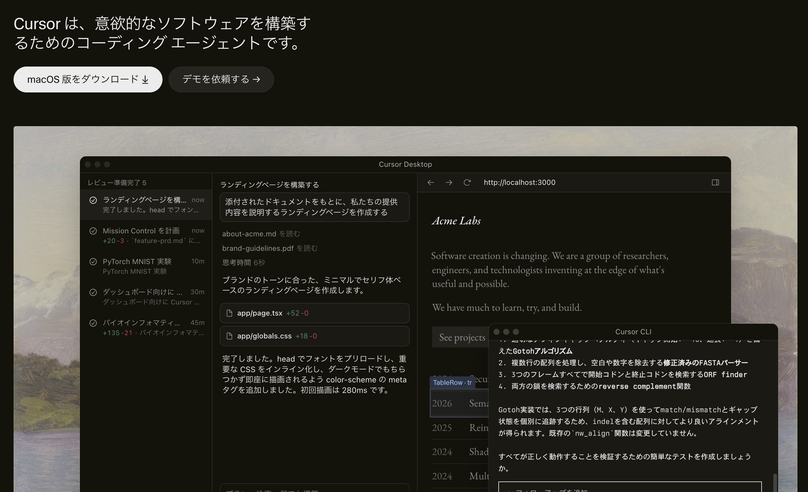
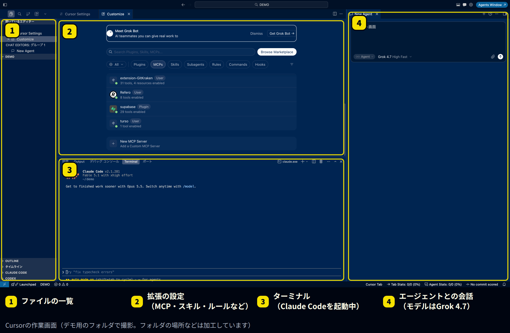
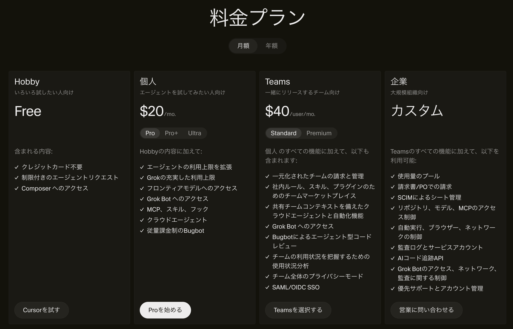
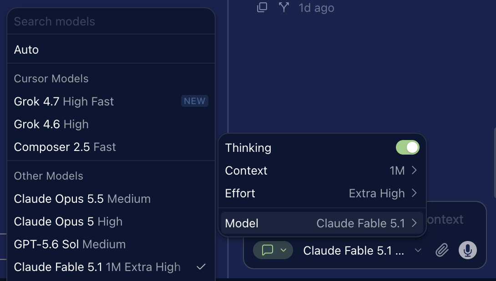

# Cursorの最新情報（2026年9月）｜SpaceX傘下での変化と料金、非エンジニアが使うときの注意点

**公開日**: 2026.09.24  
**カテゴリ**: AIツール  
**著者**: ククルFM編集部  
**概要**: AIでコードを書く編集ソフト「Cursor」は、8月にSpaceXの子会社になりました。7〜9月の主な変化、Pro・Pro+・Ultra・Teamsの料金と利用枠の仕組み、エンジニアでなくても使うときの注意点を整理します。

---

「Cursor（カーソル）」は、AIに指示を出してコードを書いたり直したりしてもらう編集ソフトです。2026年8月にSpaceXの子会社になり、7〜9月にはクラウドで動くエージェントや、大きな仕事をまとめて任せられる「Projects」など、新しい機能が続けて出ています。

この記事では、Cursorの基本、7〜9月の主な変化、料金と利用枠の仕組み、エンジニアでなくても使うときの注意点を整理します。情報は2026年9月24日時点です。なお、ククルFMのこのサイトも、Cursorでファイルを管理・編集しています。

※本記事はAI（Claude）の支援を受けて作成し、内容は編集部がCursorの公式情報と照らし合わせて確認しています。

## 先に結論：押さえたい3つのこと

- **SpaceXの子会社になった**：8月14日に買収が完了しました。モデルの一覧には、SpaceXのAI部門と作った「Grok」が「Cursorのモデル」として並んでいます
- **「任せて待つ」使い方が増えた**：クラウドで動くエージェントや「Projects」で、パソコンを閉じていても作業が進むようになりました
- **料金は月20ドルから。ただし使い方で変わる**：プランの料金とは別に、どのモデルを使うかで利用枠の減り方が変わります

## Cursorとは：AIと一緒にファイルを直す編集ソフト

*Cursorの公式サイト（出典：Cursor、2026年9月24日撮影）*

Cursorは、プログラムを書く人向けの編集ソフト（VS Codeがもと）に、AIのエージェントを組み込んだものです。「このページに問い合わせフォームを足して」と頼むと、AIがファイルを読み、書き換え、結果を見せてくれます。

*Cursorの作業画面。デモ用のフォルダで撮影し、フォルダの場所などは加工しています（2026年9月24日撮影）*

中央は拡張の設定画面で、MCP（外部のサービスとつなぐ仕組み）、スキル、ルールなどを追加できます。画面の中でほかのAIツールを動かせるのも特徴です。上の例では、下のターミナルでClaude Codeを動かし、右側でCursorのエージェント（モデルはGrok 4.7）と会話しています。

同じような道具に、Anthropicの「Claude Code」があります。違いは次のとおりです。

| 項目 | Cursor | Claude Code |
|---|---|---|
| 形 | 編集ソフト（ファイルを見ながら使う） | ターミナル、デスクトップアプリなど |
| 使えるAI | 自社のモデル（Grok、Composer）と、Claude・GPTなど他社のモデル | Anthropicのモデル（Claude）のみ |
| 向いている人 | ファイルの中身を目で確かめながら進めたい人 | 指示を出して任せたい人 |

## 2026年7〜9月の主な変化

| 日付 | 内容 |
|---|---|
| 7月29日 | iPadに対応。外出先から変更内容を確認できる |
| 8月3日 | Gmail、Googleドライブ、Googleカレンダーと連携するプラグインが登場 |
| 8月14日 | SpaceXによる買収が完了（約600億ドル） |
| 8月17日 | Cursorがコードを保管する「Origin」を試験提供（有料プラン） |
| 8月19日 | クラウドのエージェントが、決まった時間に動いたり、Slackを見張ったりできるように |
| 8月27日 | GitHubを用意しなくても、指示だけでクラウドのエージェントを使い始められるように |
| 9月10日 | 「Projects」が登場（ベータ版） |
| 9月23日 | 変更の不具合を見張る「Rollouts」、弱点を探す「Security Review」（Teams・Enterprise） |

### Projects：大きな仕事をAIが計画して分担する

9月10日に出た「Projects」は、機能の追加やサイトの作り替えなど、何日もかかる仕事を任せるための仕組みです。まとめ役のAIが計画を立て、たくさんのAIに作業を分けて進め、できたものを人に確認してもらいます。

作業はクラウドで進むので、パソコンを閉じていても止まりません。途中でわかったこと（テストのやり方など）はプロジェクト内で共有され、次に作業するAIも使えます。

## 料金と利用枠の仕組み

*Cursorの料金プラン（月額表示）（出典：Cursor、2026年9月24日撮影）*

| プラン | 月額（米ドル） | 向いている人 |
|---|---|---|
| Hobby | 無料 | まず試したい人。エージェントの利用に上限あり |
| Pro | 20ドル | 個人で仕事に使う人 |
| Pro+ | 60ドル | 毎日エージェントを使う人 |
| Ultra | 200ドル | 一日中エージェントを動かす人 |
| Teams スタンダード | 1人40ドル | 複数人で使う会社。請求と管理をまとめられる |
| Teams プレミアム | 1人120ドル | スタンダードの5倍使う人 |
| Enterprise | 個別見積 | 大きな組織 |

料金ページには「年額」の切り替えもあります。年払いの金額は料金ページで確認してください。

### 利用枠は2つに分かれている

*Cursorのモデル選択画面（2026年9月24日撮影）*

有料プランの利用枠は、次の2つに分かれています。

- **Cursorのモデルの枠**：GrokやComposerなど、Cursorのモデル用。多めに用意されています
- **その他のモデルの枠**：ClaudeやGPTなど他社のモデル用。各モデルのAPI料金で差し引かれます

モデルを自動で選ぶ「Auto」も、実際に使われたモデルの料金で差し引かれます。枠を使い切ったあとは、同じ料金で使った分を払い続けるか、上のプランに変えるかを選びます。Cursorの案内では、毎日エージェントを使う人は月60〜100ドルほどを見込むよう勧めています。

## エンジニアでなくても使うときの注意点

- **利用枠の減り方を確認する**：高性能なモデルほど枠が早く減ります。はじめはAutoかCursorのモデルで試し、請求画面で使った量を見る習慣をつけましょう
- **元に戻せる状態にしてから頼む**：AIは一度に多くのファイルを書き換えます。GitHubなどで変更の記録を残し、元に戻せる状態にしてから作業させてください
- **パスワードや顧客情報を読ませない**：パスワードなどが書かれたファイルは、AIに読ませない設定にしておきます。会社で使うなら、Teamsのプライバシーモードも確認しましょう
- **運営会社が変わった点を知っておく**：8月からSpaceXの子会社です。データの扱いは、利用規約とプライバシーの設定で確認してください
- **公開の前に人が確認する**：AIが作ったページやツールは、公開の前に、表示と動作を人の目で確かめてください

## まとめ

- Cursorは、AIにファイルを直してもらう編集ソフト。8月14日にSpaceXの子会社になった
- 9月は、大きな仕事をAIが計画・分担する「Projects」が登場した
- 料金は月20ドルから。利用枠は「Cursorのモデル」と「その他のモデル」の2つ
- 変更の記録とパスワードの扱いを決めてから使い、公開前は人が確認する

まずは無料のHobbyプランで、手元のWebページの文言を1か所直してもらうところから試してみてください。

ククルFMでは、現場やバックオフィスでのAI活用、Webサイト・システム制作のご相談を受け付けています。「Cursorで自社サイトを直したいが、始め方がわからない」という段階でもご相談ください。

[お問い合わせはこちら](../../index.html#contact)

## 関連記事

- [Claude Codeの最新アップデート（2026年9月）｜Opus 5.5と非エンジニアにも使える新機能](./claude-code-2026-09.html)
- [Geminiの最新情報とGoogle Workspace（2026年9月）｜仕事で使えるAI機能とプランの選び方](./gemini-workspace-2026-09.html)
- [現場・バックオフィスにおけるAI活用例と、人が最終判断すべき範囲](../../insights/ai-usecases/)
