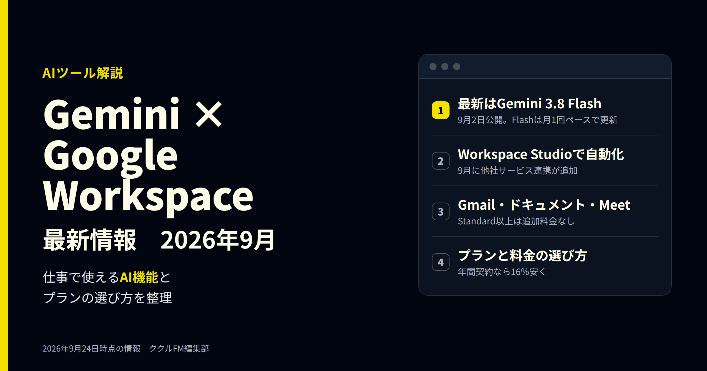
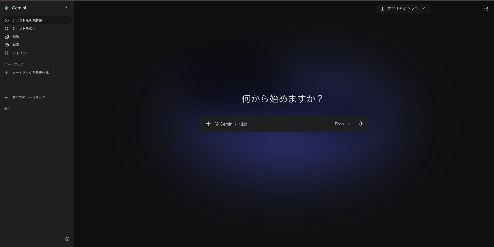
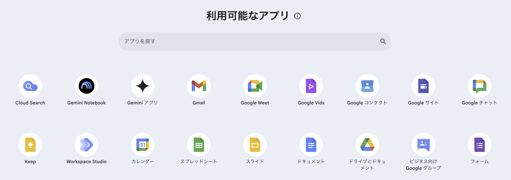
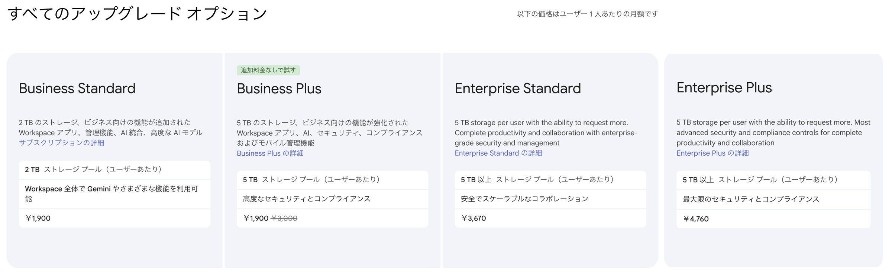

# Geminiの最新情報とGoogle Workspace（2026年9月）｜仕事で使えるAI機能とプランの選び方

**公開日**: 2026.09.24  
**カテゴリ**: AIツール  
**著者**: ククルFM編集部  
**概要**: Geminiの最新モデルは9月2日公開のGemini 3.8 Flashです。7〜9月のモデルの更新を整理し、Gmail・ドキュメント・Meetなど、Google Workspaceで仕事に使えるGeminiの機能、9月の新機能、プランと料金の選び方を解説します。

---

Googleの生成AI「Gemini（ジェミニ）」は、7月から9月にかけて毎月のように新しいモデルが出ています。会社で使っているGoogle Workspace（Gmail、ドキュメント、スプレッドシート、Meetなど）でも、Geminiを使った機能が増え続けています。

この記事では、Geminiの最新モデル、Workspaceで仕事に使える機能、9月の主な新機能、プランと料金の選び方を整理します。情報は2026年9月24日時点です。機能は順番に提供されるため、使う前に公式の情報も確認してください。

※本記事はAI（Claude）の支援を受けて作成し、内容は編集部がGoogleの公式情報と照らし合わせて確認しています。

## 先に結論：押さえたい3つのこと

- **最新モデルはGemini 3.8 Flash**：9月2日公開。Flashは7月から毎月更新されています。上位モデルの3.5 Proは、9月24日時点で正式な公開の発表がありません
- **Business Standard以上なら、Geminiは追加料金なし**：Gmail、ドキュメント、スプレッドシート、Meetなどで使えます。Business Starterは一部の機能だけです
- **9月は「自動化」が進んだ**：Workspace Studioで、Asanaなど他社のサービスと連携した自動化を作れるようになりました

## Geminiの最新モデル（2026年7〜9月）

*Geminiアプリのホーム画面。入力欄の右でモデルを切り替えられる（2026年9月24日撮影。アカウント名や履歴は加工しています）*

Geminiは、5月のGoogle I/Oで発表された3.5世代のあと、軽くて速い「Flash」が毎月のように更新されています。

| 公開日 | モデル | 内容 |
|---|---|---|
| 7月21日 | Gemini 3.6 Flash | 中心となるモデル。前のモデルより使う量（トークン）を最大17％減らした |
| 7月21日 | Gemini 3.5 Flash-Lite | 低価格のモデル |
| 8月13日 | Gemini 3.7 Flash | Flashの更新 |
| 8月27日 | Gemini Omni Flash | 動画の生成・拡張向け |
| 9月2日 | Gemini 3.8 Flash | 最新のFlash |
| 9月15日 | Gemini 3.8 Live | 声でリアルタイムに会話するためのモデル |
| 9月22日 | Gemini 3.8 Flash TTS | 文章の読み上げ（音声合成）向け |

上位モデルの「Gemini 3.5 Pro」は、7月の時点で「パートナー企業と試験中」とされていました。9月24日時点でも、Googleの開発者向けリリースノートに正式公開の記載はありません。

Geminiアプリでは、細かい番号ではなく「Flash」などの名前で表示されます。どの番号のモデルが使われるかは、プランや時期によって変わります。

## Google Workspaceで使えるGeminiの機能

*Google Workspaceで利用できるアプリの一覧（2026年9月24日撮影）*

Workspaceでは、いつものアプリの中からGeminiを呼び出せます。

| アプリ | Geminiでできること（例） |
|---|---|
| Gmail | 長いメールのやり取りを要約する、返信の下書きを作る |
| ドキュメント | 文章の下書き、言い換え、要約 |
| スプレッドシート | 表の作成、データの整理や分析、AI関数での一括処理 |
| Meet | 会議のメモを自動で取る（自動メモ） |
| Vids | 資料や文章から動画を作る |
| Gemini アプリ | チャットで質問する、画像や動画を作る |
| Gemini Notebook | 資料をまとめて読み込ませ、その資料をもとに質問する |
| Workspace Studio | 「メールが来たら要約してチャットに送る」などの自動化を、言葉で指示して作る |

たとえば、Workspace Studioで「毎朝、問い合わせメールを要約してチャットに送る」という仕組みを、プログラムを書かずに作れます。

## 9月の主な新機能

- **Workspace Studioで他社サービスと連携（9月17日発表）**：Asana、Jira、HubSpot、Salesforce、Slackなどとの連携（ベータ版）が加わりました。外部のサービスに通知を送る仕組み（Webhook）や、Apps Scriptを使った独自の手順も作れます。利用者への提供は9月21日から順に始まり、Business Starterから使えます
- **Geminiアプリの中でノートブックを使える（9月17日）**：資料をまとめたノートブックを、会社や学校のアカウントでもGeminiアプリから使えるようになりました
- **ドキュメントでノートブックの資料を引用（9月23日）**：Gemini Notebookに入れた資料をもとに、ドキュメントで下書きを作れます
- **Meetの自動メモの改善（9月22日）**：要点を1ページにまとめた「クイックメモ」が加わりました。9月29日からは、3人以上の会議だけで自動メモを取る設定もできます
- **Gmail検索のAIによる要約（9月18日）**：検索結果をAIが要約します。今のところ、表示言語が英語の場合だけです

## プランと料金の選び方

*管理コンソールに表示された、1ユーザーあたりの月額（2026年9月24日撮影。一部を加工しています）*

| プラン | 月額（1ユーザー） | Gemini | 向いている会社 |
|---|---|---|---|
| Business Starter | 料金ページで確認 | 一部だけ（Gmail、Vids、Geminiアプリ） | まずメールと共有の仕組みだけほしい |
| Business Standard | 1,900円 | Workspace全体で使える | 仕事でGeminiを使いたい中小企業 |
| Business Plus | 3,000円 | 同上 | セキュリティや端末の管理も強めたい |
| Enterprise Standard | 3,670円 | 同上 | 300人を超える、または管理機能が必要 |
| Enterprise Plus | 4,760円 | 同上 | 最も強いセキュリティが必要 |

金額は管理コンソールの表示です。この画面には、契約の形（年間契約か月ごとか）や税の扱いの記載がありません。Googleの料金ページによると、年間契約は月ごとの契約より16％安くなります。申し込む前に、料金ページで確認してください。画面のBusiness Plusにある「1,900円」は、試用の案内として表示された価格です。

選び方の目安は次のとおりです。

- **仕事でGeminiを使いたい**：Business Standard。Gmail、ドキュメント、Meetなど、ほぼすべてでGeminiが使えます
- **Geminiを大量に使う**：別売りの「AI Expanded Access」を追加すると、利用の上限が上がります。たとえばVidsの動画生成は月50本から200本に、スプレッドシートのAI関数は月5,000回から25,000回になります
- **Business Starterを使っている**：Gmail以外でもGeminiを使いたいなら、Standardへの切り替えを検討しましょう

## 使う前に知っておきたい注意点

- **新機能はすぐに出ないことがある**：Workspaceの新機能は、会社ごとに順番に届きます。管理者の設定でオフになっている場合もあります
- **英語だけの機能がある**：Gmail検索のAI要約のように、日本語ではまだ使えない機能があります
- **データの扱い**：Googleは、Workspaceのデータを許可なくAIの学習に使わず、Geminiアプリでのやり取りも人が確認しないとしています。個人のGoogleアカウントで使う場合は、条件が違うので設定を確認してください
- **最後は人が確認する**：要約や下書きには間違いが入ることがあります。数字、固有名詞、社外に出す文章は、人が確認してから使ってください

## まとめ

- Geminiの最新は9月2日公開の3.8 Flash。上位の3.5 Proはまだ正式な公開の発表がない
- Business Standard以上なら、Gmail、ドキュメント、Meetなどで追加料金なしで使える
- 9月はWorkspace Studioで、他社サービスと連携した自動化が作れるようになった
- データは許可なく学習に使われない。ただし最後の確認は人が行う

まずは、毎日使っているGmailで「このやり取りを要約して」と頼むところから試してみてください。

ククルFMでは、現場やバックオフィスでのAI活用、Webサイト・システム制作のご相談を受け付けています。「Google Workspaceを入れたが、Geminiを業務にどう使えばいいか分からない」という段階でもご相談ください。

[お問い合わせはこちら](../../index.html#contact)

## 関連記事

- [Cursorの最新情報（2026年9月）｜SpaceX傘下での変化と料金、非エンジニアが使うときの注意点](./cursor-2026-09.html)
- [Claude Codeの最新アップデート（2026年9月）｜Opus 5.5と非エンジニアにも使える新機能](./claude-code-2026-09.html)
- [GPT-6のAstra・Sol・Lunaの違いは？料金と使い分けを比較](./gpt-6-astra-sol-luna.html)
- [現場・バックオフィスにおけるAI活用例と、人が最終判断すべき範囲](../../insights/ai-usecases/)
