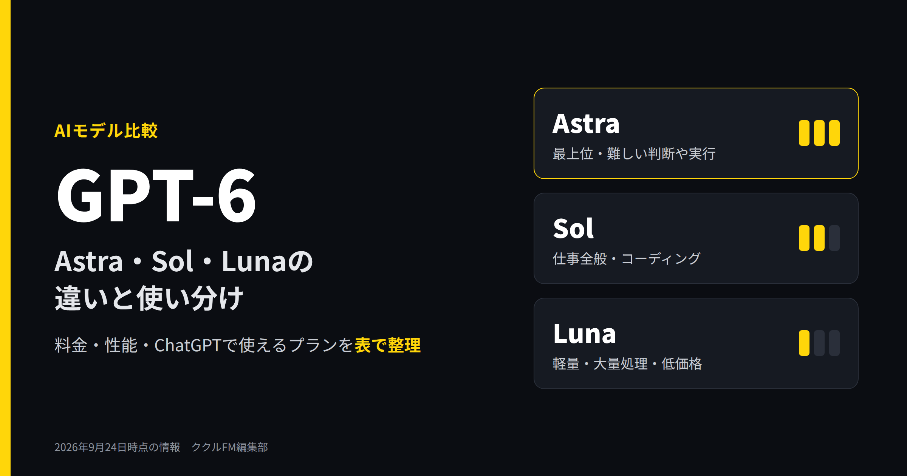
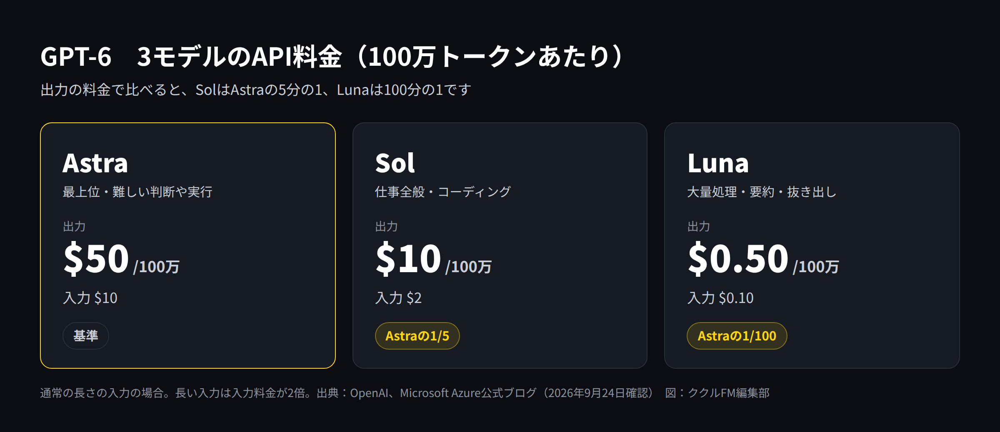
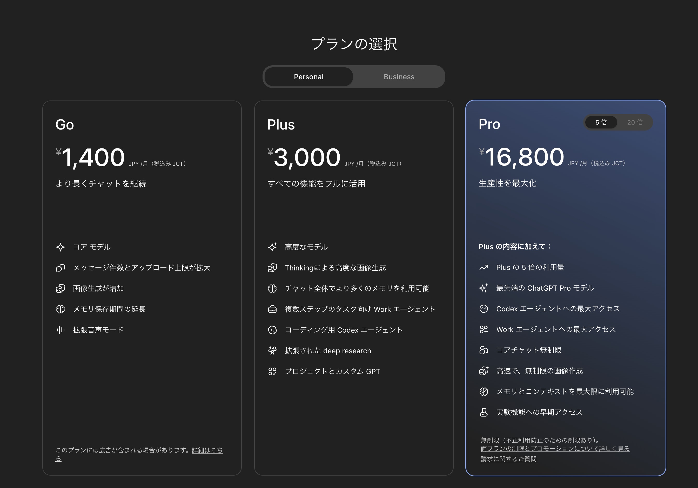
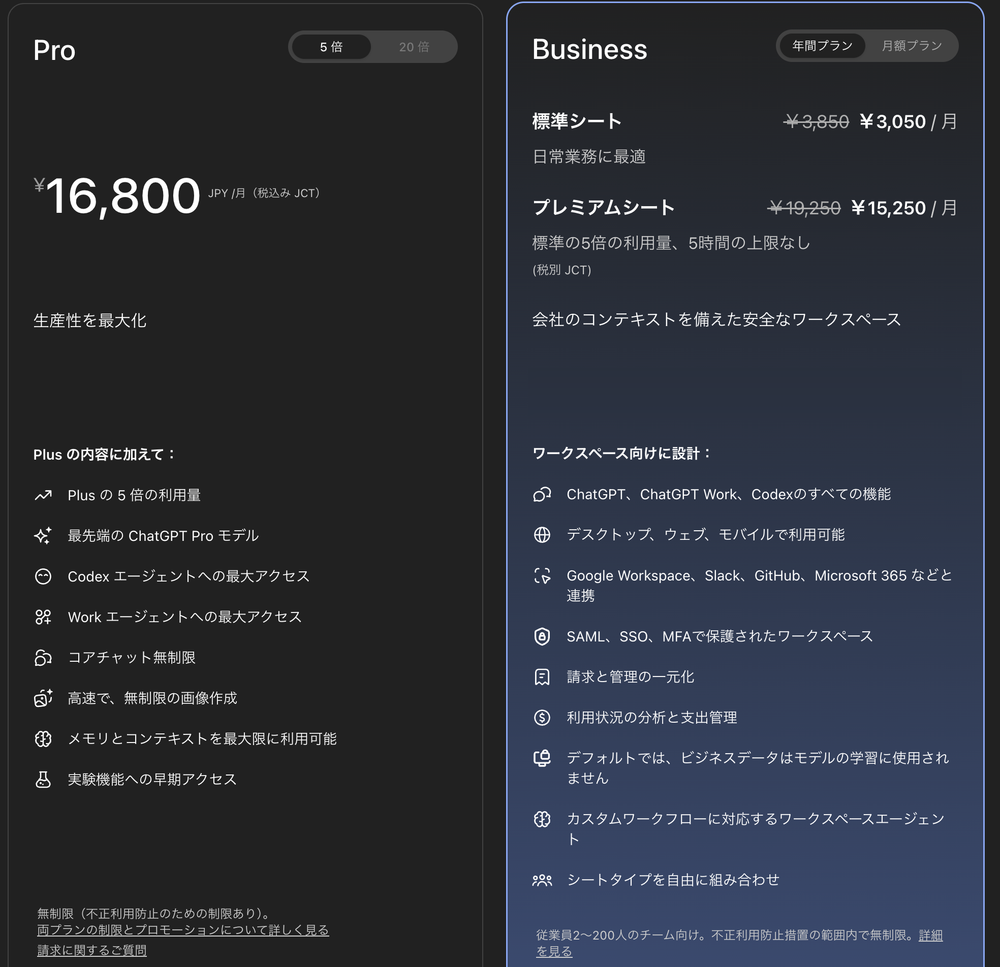

# GPT-6のAstra・Sol・Lunaの違いは？料金と使い分けを比較

**公開日**: 2026.09.24  
**カテゴリ**: AIツール  
**著者**: ククルFM編集部  
**概要**: GPT-6にはAstra・Sol・Lunaの3モデルがあります。性能と料金の違い、ChatGPTのどのプランで使えるか、業務別の使い分けを表で整理しました。GPT-5.6と名前が紛らわしい点も解説します。

---

OpenAIの新しいAIモデル「GPT-6」は、Astra（アストラ）、Sol（ソル）、Luna（ルナ）の3つで構成されています。2026年9月3日に最上位のAstraが、9月22日にSolとLunaが発表されました。

3つのモデルは性能と料金が大きく違い、ChatGPTのどのプランの、どの画面から使えるかも異なります。さらに、前の世代のGPT-5.6とモデル名が一部重なっていて、混乱しやすい状況です。

この記事では、3モデルの違い、料金、ChatGPTで使えるプラン、業務別の使い分けを表で整理します。情報は2026年9月24日時点のものです。発表から日が浅く、提供範囲は今後も変わる可能性があるため、利用前に公式サイトも確認してください。

## GPT-6とは：3つのモデルの構成

GPT-6は、OpenAIが2026年9月に発表したAIモデルの世代です。用途と価格帯が違う3つのモデルがあります。

- **Astra**：最上位のモデルです。OpenAIは「世界で最も賢いモデル」と位置づけ、パソコンの操作、ソフトウェア開発、専門的な業務などで高い性能を示したとしています。
- **Sol**：仕事全般向けのモデルです。コーディングや、いくつもの手順が必要な業務に向きます。OpenAIによると、前の世代のGPT-5.6 Solと比べて間違いが約半分になりました。
- **Luna**：軽くて安いモデルです。文書の要約、情報の抜き出し、簡単な質問への回答など、大量の定型作業に向きます。

SolとLunaについてOpenAIは、Astraと同じ方法で訓練し、Astraで得られた改良を低いコストで使えるようにしたモデルだと説明しています。

## 3モデルの違い一覧

| 項目 | Astra | Sol | Luna |
|---|---|---|---|
| 位置づけ | 最上位 | 仕事全般 | 軽量・低価格 |
| 向いている仕事 | 難しい判断、複雑な分析、パソコン操作の自動化 | 資料作成、コーディング、手順の多い業務 | 要約、情報の抜き出し、問い合わせの振り分け |
| API料金（100万トークンあたり、入力／出力） | 10ドル／50ドル | 2ドル／10ドル | 0.10ドル／0.50ドル |
| 第三者機関の性能評価（※） | 53 | 48 | 37 |
| 発表日 | 2026年9月3日 | 2026年9月22日 | 2026年9月22日 |

※Artificial Analysisの総合指標（Intelligence Index）の最高値。参考として、前の世代の中位モデルGPT-5.6 Terraは42です。

OpenAIは各種の試験（ベンチマーク）でAstraが最高水準だったと発表していますが、これは自社での測定です。第三者機関の評価でも「Astra＞Sol＞Luna」の順は変わりません。なお、Lunaの評価は前の世代の中位モデル（GPT-5.6 Terra）より低く、難しい仕事を任せるモデルではありません。

## 料金の比較

### API（システムに組み込む場合）の料金

出力の料金で比べると、SolはAstraの5分の1、Lunaは100分の1です。OpenAIによると、SolとLunaは前の世代の半額になりました。長い文章を入力する場合は、入力の料金が2倍になります。

ただし、単価だけで選ぶのはおすすめしません。Microsoftは「1トークンあたりの単価ではなく、1つの仕事を終えるまでの総額で比べるべき」としています。性能の高いモデルほど、少ないやり取りで仕事を終えられることがあるためです。

### ChatGPTの料金（日本円）

*ChatGPTの個人向けプラン（税込み）（出典：OpenAI、2026年9月24日撮影）*

| プラン | 月額 | 向いている人 |
|---|---|---|
| 無料 | 0円 | まず試したい人 |
| Go | 1,400円（税込み） | 軽く使う個人 |
| Plus | 3,000円（税込み） | 仕事で使う個人 |
| Pro（5倍） | 16,800円（税込み） | 利用量が多い個人 |
| Business | 標準シート1人3,050円、プレミアムシート1人15,250円（年間プラン、税別） | 2〜200人の会社 |

Proには利用量が「5倍」と「20倍」の2種類があります。20倍（月200ドル）は、Astraへの需要の急増を理由に、2026年9月10日から新規の申し込みとアップグレードが一時停止されています（既存の契約は継続）。

*ProとBusinessのプラン。Businessは、会社のデータをデフォルトでモデルの学習に使わないと記載されている（出典：OpenAI、2026年9月24日撮影）*

## ChatGPTのどのプランで使えるか

ここが一番わかりにくい点です。2026年9月24日時点では、GPT-6はChatGPTの「通常のチャット」ではまだ一部しか使えず、主に「Work」と「Codex」から使います。

- **Work**：資料、表、スライドなどの成果物を、いくつもの手順を踏んで作るエージェント機能
- **Codex**：ソフトウェア開発向けのエージェント機能

| プラン | 通常のチャット | Work・Codex |
|---|---|---|
| 無料・Go | GPT-5.6 Luna | 使えない |
| Plus | GPT-5.6 Sol | GPT-6 Astra・Sol・Luna |
| Pro | GPT-5.6 Sol、GPT-6 Pro（中身はAstra） | GPT-6 Astra・Sol・Luna |
| Business・Enterprise | GPT-5.6 Sol、GPT-6 Pro（中身はAstra） | GPT-6 Astra・Sol・Luna |

補足すると、次の3点があります。

- **無料・Goでも、デスクトップアプリではGPT-6 Lunaが使えます**（OpenAIの発表。9月22日から順番に提供）。
- **SolとLunaは順番に提供中です。** プランやワークスペースの設定によっては、まだ表示されない場合があります。
- **通常のチャットの「GPT-6 Pro」は回数に上限があります。** Pro（20倍）は週200回、Pro（5倍）は週50回（GPT-5.6 Sol Proと共通）です。

## 業務別の使い分け

中小企業の日常業務に当てはめると、次のような使い分けになります。

| やりたいこと | おすすめ | 理由 |
|---|---|---|
| 日報や議事録の要約、書類からの情報の抜き出し、問い合わせの振り分け | Luna | 定型で量が多い作業。安く速く処理できる |
| 見積書や提案書のたたき台、Excelの集計、社内ツールのコード | Sol | 手順の多い業務やコーディング向け。料金はAstraの5分の1 |
| 新規事業の検討、複雑なデータの分析、パソコン操作の自動化 | Astra | 判断の難しい仕事や、画面を操作しながら進める仕事向け |

プランの選び方は次のとおりです。

- **まず試したい**：無料プランのデスクトップアプリでLunaを使ってみる
- **個人で仕事に使いたい**：Plus（月3,000円）。WorkとCodexからAstraとSolが使える
- **通常のチャットでもAstraを使いたい、利用量が多い**：Pro
- **会社で複数人が使う**：Business。管理機能があり、会社のデータがデフォルトで学習に使われない

## 注意点

- **モデル名が紛らわしい**：前の世代のGPT-5.6では、Solが最上位、Terraが中位、Lunaが軽量でした。GPT-6では最上位がAstraで、Solは中位です。「Sol＝最上位」と覚えている人は注意してください。また、ChatGPTの通常のチャットにある「GPT-6 Pro」は、中身がAstraです。
- **提供範囲が変わりやすい**：発表から日が浅く、使えるプランや画面は今後も変わる可能性があります。
- **性能の数値はOpenAIの発表が中心**：第三者機関の評価もあわせて確認しましょう。
- **機密情報の扱い**：顧客情報や社外秘の資料を入れる場合は、学習に使われない設定になっているかを必ず確認してください。Businessはデフォルトで学習に使われません。個人プランは設定を確認してから使いましょう。
- **最後は人が確認する**：どのモデルも間違えることがあります。数字や固有名詞、契約に関わる内容は、人が確認してから使ってください。

## まとめ

- GPT-6は、最上位のAstra、仕事全般のSol、軽量なLunaの3モデル
- API料金は、出力でSolがAstraの5分の1、Lunaが100分の1
- ChatGPTでは、通常のチャットではまだ一部のみ。主にWorkとCodexから使う
- 定型作業はLuna、日常業務はSol、難しい判断はAstraが目安
- GPT-5.6とは名前の意味が違う。特に「Sol」に注意

まずは無料のデスクトップアプリでLunaを試し、足りなければPlusでSolやAstraを使ってみる、という順番がおすすめです。

ククルFMでは、現場やバックオフィスでのAI活用、Webサイト・システム制作のご相談を受け付けています。「どのAIをどの業務に使えばいいか分からない」という段階でもご相談ください。

[お問い合わせはこちら](../../index.html#contact)

## 関連記事

- [Referoとは？特徴・料金とMCP連携でAIっぽさを減らす方法](./refero-mcp.html)
- [現場・バックオフィスにおけるAI活用例と、人が最終判断すべき範囲](../../insights/ai-usecases/)
- [AI導入が現場に定着しない理由。業務設計・教育・ルール・評価から考える](../../insights/ai-teichaku/)
