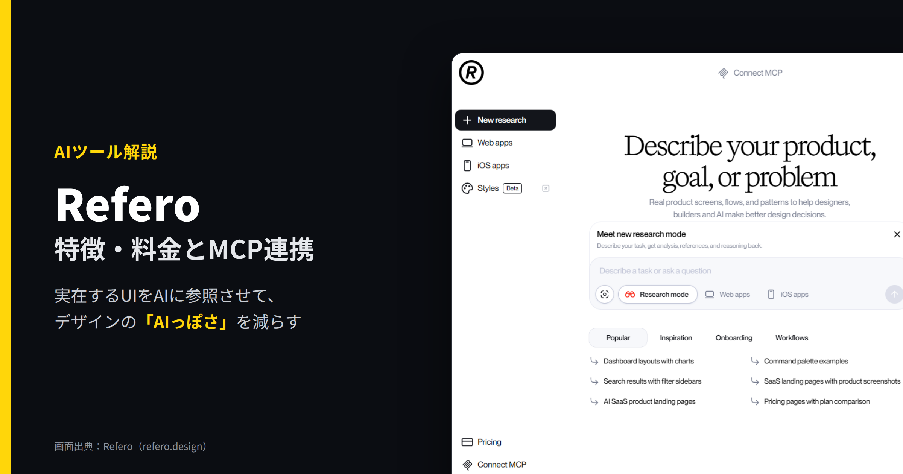
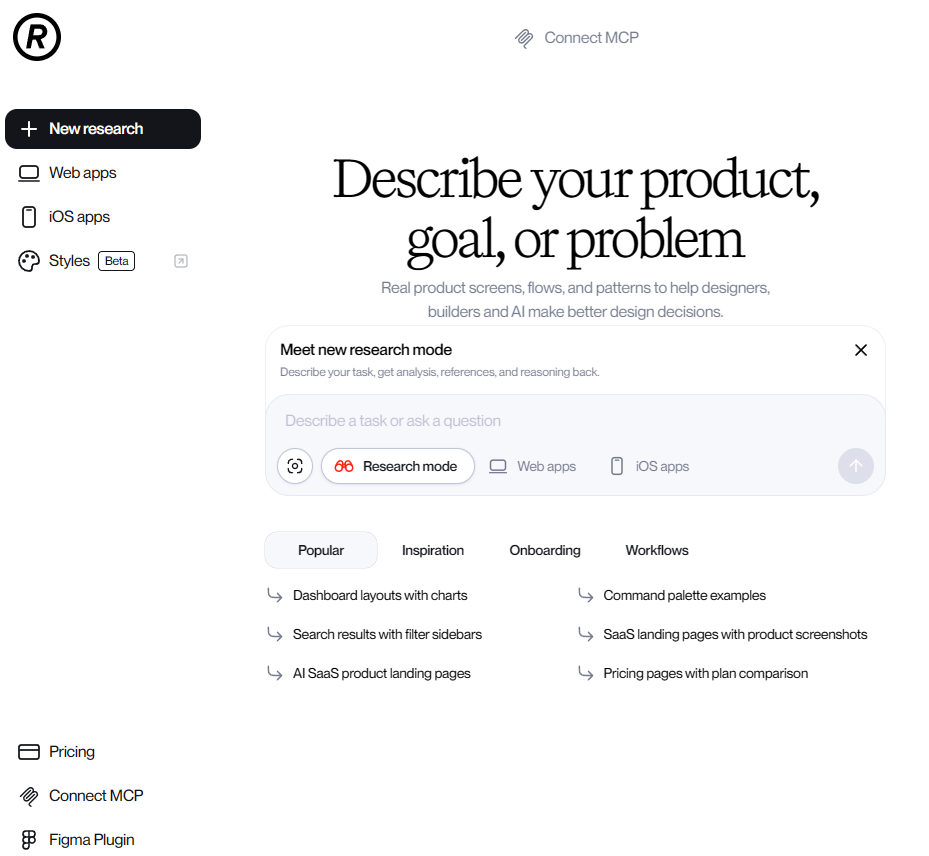
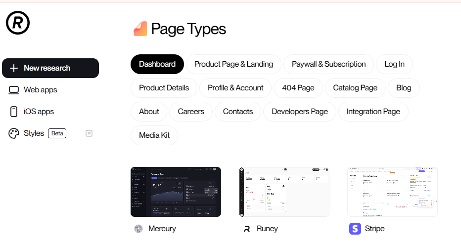
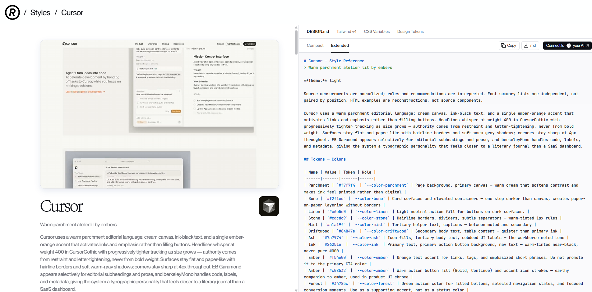
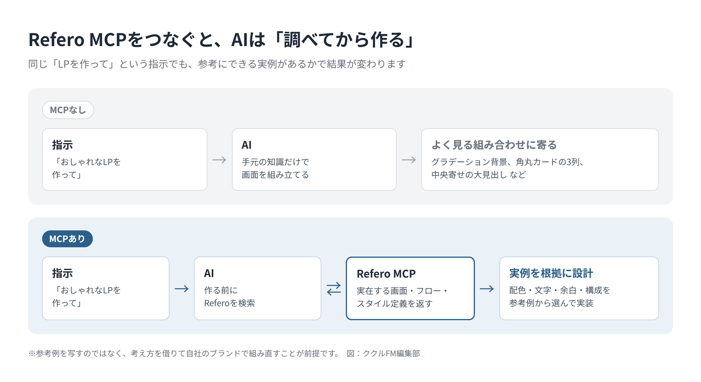
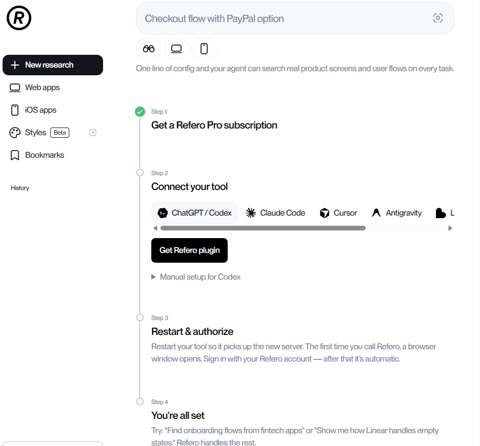
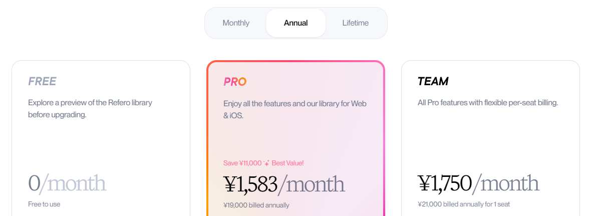

# Referoとは？特徴・料金とMCP連携でAIっぽさを減らす方法



**公開日**: 2026.09.24  
**カテゴリ**: AIツール  
**著者**: ククルFM編集部  
**概要**: Referoは実在するWeb・iOSの画面やフロー、デザインスタイルを集めた参考ライブラリです。MCPでClaude CodeやCursorとつなぐと、AIが実例を調べてから画面を作れます。特徴・始め方・料金・注意点を解説します。

---

AIにWebサイトやアプリの画面を作らせると、どこかで見たような仕上がりになることがあります。グラデーションの背景、角丸カードの3列並び、中央寄せの大きな見出し。いわゆる「AIっぽい」デザインです。

理由のひとつは、AIが具体的な参考例を持たないまま、よく見る組み合わせで画面を組み立てることにあります。そこで役立つのが、実在するWebサービスやiOSアプリの画面を集めたデザイン参考ライブラリ「Refero」です。MCPという仕組みでClaude CodeやCursorなどのAIツールとつなぐと、AIが作業の前に実例を探し、それを根拠に画面を組み立てられるようになります。

この記事では、Referoの特徴と強み、MCP連携の始め方、料金と注意点をまとめます。情報は2026年9月時点のものです。

## Referoとは

Referoは、実在するWebサービスとiOSアプリの画面、画面の流れ（ユーザーフロー）、デザインスタイルを集めたライブラリです。「Design research for the AI era（AI時代のデザインリサーチ）」を掲げ、デザイナーだけでなく、開発者やAIがデザインを決めるための材料を提供しています。

収録数は、料金ページの表記で14万2,000画面以上、公式GitHubによるとフローは6,000件以上です。画面は毎週追加されています。対象はWebとiOSで、Androidアプリは含まれません。

トップ画面は「Describe your product, goal, or problem（作りたいもの、目的、課題を書いてください）」という入力欄が中心です。左のメニューから、Webアプリ、iOSアプリ、Styles（ベータ版）を切り替えて探せます。


*Referoのトップ画面。作りたいものや課題を文章で入力して探す（出典：Refero）*

## Referoの特徴・強み

### 1. 実在するサービスの画面だけを集めている

デザイナーの作品投稿サイトには、実際には公開されていないコンセプト作品も多く含まれます。Referoが集めているのは、実際にリリースされているサービスの画面です。見た目の好みだけでなく、実際のサービスで使われている配置や導線を確認できます。

探し方も実務向けです。「ページの種類」から、ダッシュボード、商品ページ・LP、料金・課金画面、ログイン、404ページ、ブログ、会社概要、採用、問い合わせなどを選べます。これから作るページと同じ種類の実例を並べて比べられます。


*「Page Types」から、作りたいページの種類を選んで実例を探せる（出典：Refero）*

### 2. 画面単体だけでなく「流れ」で見られる

会員登録、初回の使い方案内（オンボーディング）、決済のように、複数の画面にまたがる流れ（フロー）も収録されています。1枚の画面の見た目だけでなく、「どの順番で何を見せるか」というUXの参考になります。

### 3. Styles：デザインのルールをAIが読める形式で受け取れる

ベータ版の「Styles」では、実在サービスのデザインルールを2,000件以上公開しています（毎週追加）。色、文字、余白、角の丸み、影、部品ごとの扱いがまとめられていて、DESIGN.md（AI向けの説明書の形式）、Tailwind v4、CSS変数、デザイントークンの4つの形式でコピー・ダウンロードできます。

たとえばCursorのスタイルでは、背景色、文字色、アクセント色が一つずつ名前と値つきで並び、「どこに使う色か」「何に使ってはいけないか」まで説明されています。AIに渡せば、色の値だけでなく使い分けの意図まで伝わります。


*Stylesの画面。右側にDESIGN.md形式のデザインルールが表示される（出典：Refero）*

### 4. 文章で相談できるResearch mode

トップ画面には新機能の「Research mode」があります。やりたいことや課題を文章で書くと、分析、参考例、その理由をまとめて返す機能です。何を探せばよいか分からない段階でも使えます。

### 5. AIツールから直接使えるMCP連携

Referoの最大の特徴が、MCPへの対応です。MCP（Model Context Protocol）は、AIツールが外部のサービスやデータを使うための共通の仕組みです。Referoをつなぐと、AIが自分でReferoを検索し、実例を見ながら作業できるようになります。

## なぜMCP連携で「AIっぽさ」が減るのか

AIに「おしゃれなLPを作って」とだけ頼むと、手元の知識だけで画面を組み立てるため、よく見る組み合わせに寄りやすくなります。Refero MCPをつなぐと、AIは作業の前に実在の画面・フロー・スタイルを検索し、そこから配色や余白、構成を選んで実装できます。



MCPでAIが使える機能は10種類あり、大きく3つに分けられます。

| 種類 | AIができること |
|---|---|
| 探す | Webサイト、iOSアプリ、スタイル、画面、フローをキーワードで検索する |
| 詳しく見る | スタイルの色・文字・余白・角の丸み・影、画面のフォントやページの種類、フローの各ステップを取得する |
| 広げる | 似た画面を探す、画面の画像を取得する |

Refero公式は、AI向けの手順書（スキル）も公開しています。「実装の前に必ずリサーチする」「デザインの判断を参考例に結びつける」といった手順をAIに守らせるものです。MCPとあわせて使うと、「調べてから作る」流れが崩れにくくなります。

ただし、参考先が良くても、指示が曖昧なら結果もぶれます。「誰向けの、何のページか」「どのサービスの雰囲気に近づけたいか」を具体的に伝えることが大切です。

## Refero MCPの始め方

Referoの「Connect MCP」の画面に手順がまとまっています。

1. **有料プランに登録する**：MCPはPro、Team、Lifetimeプランで使えます。無料プランでは使えません。
2. **使うツールを選んで接続する**：ChatGPT/Codex、Claude Code、Cursor、Antigravity、Lovableなどに対応しています。専用のプラグインか、手動の設定で接続します。
3. **ツールを再起動してログインする**：初めてReferoを呼び出したときにブラウザが開くので、Referoのアカウントでログインします。2回目以降は自動です。
4. **試してみる**：「フィンテックアプリのオンボーディングの流れを探して」のように頼むと、AIがReferoを検索します。


*「Connect MCP」の画面。4つのステップで接続できる（出典：Refero）*

Claude Codeに手動で追加する場合は、次のコマンドを使います（公式ドキュメントより）。

```bash
claude mcp add --transport http refero https://api.refero.design/mcp
```

ブラウザでのログイン（OAuth）ではなくAPIトークンで認証する場合は、末尾に `--header "Authorization: Bearer <トークン>"` を付けます。トークンは他人に見せたり、公開するファイルに含めたりしないでください。

MCPの利用回数は、1ユーザーあたり月8,000回までです。使い切れなかった分は翌月に繰り越されません。

## 料金プラン

2026年9月24日時点で、日本からアクセスした場合の料金ページの表示です。


*料金ページ（年払いの表示）。月払い・年払い・買い切りを切り替えて確認できる（出典：Refero）*

| プラン | 料金（年払い） | 主な内容 | MCP |
|---|---|---|---|
| Free | 無料 | ライブラリの約3%のみ閲覧できる、基本的な検索 | × |
| Pro | 月1,583円（年19,000円） | Web・iOSの14万2,000画面以上、フロー、ダウンロード、Figmaプラグイン | ○ |
| Team | 1人あたり月1,750円（年21,000円） | Proの内容に加え、チームでのブックマーク共有、管理画面 | ○ |
| Lifetime | 買い切り（価格は料金ページで確認） | Proの内容（1人用） | ○ |
| Enterprise | 個別見積もり | SAML SSO、優先サポート、個別の契約 | 要問い合わせ |

Proは年払いにすると、月払いより年11,000円安くなると表示されています。支払いは月払いと年払いから選べます。支払い方法はクレジットカード、Apple Pay、銀行振込など（地域によって異なります）。支払い済みの料金は、法律で必要な場合を除いて返金されません。また、アカウントの共有はどのプランでも禁止されています。

## 注意点・向かない人

- **無料では主な機能が使えない**：無料プランで見られるのはライブラリの約3%です。MCP、フロー、Figmaプラグインは有料プランのみです。
- **Androidアプリは対象外**：Android向けの画面を探したい人には向きません。
- **画面の表記や説明は英語**：メニューや各スタイルの解説は英語で書かれています。
- **参考と模倣は別物**：実在サービスの画面をそのまま写すと、権利の侵害やブランドの混同につながるおそれがあります。配色や構成の「考え方」を借りて、自社のブランドで組み直すことが前提です。
- **最後は人が判断する**：AIが選んだ参考例が、自社の読者や業種に合うとは限りません。採用するかどうかは人が決めます。

## Mobbinとの違い

似たサービスに「Mobbin」があり、こちらもMCPに対応しています（2026年9月時点ではベータ版）。

| 項目 | Refero | Mobbin |
|---|---|---|
| 収録対象 | Web・iOS | モバイル・Web |
| 収録画面数 | 14万2,000画面以上 | 62万画面以上 |
| MCPが使えるプラン | Pro・Team・Lifetime | Pro・Team |
| MCPの回数上限 | 月8,000回 | ベータ期間中は無制限（今後は上限を設ける予定） |
| 特徴 | Stylesで、AIに渡せる形式のデザインルールが手に入る | 収録数が多い |

Webサイトを作る場面で、AIにデザインのルールまで渡したいならRefero、とにかく多くの実例から探したいならMobbin、という選び方ができます。料金は変わることがあるため、どちらも公式サイトで確認してください。

## まとめ

- Referoは、実在するWeb・iOSの画面、フロー、スタイルを集めたデザイン参考ライブラリ
- MCPでAIツールとつなぐと、AIが作業の前に実例を調べ、それを根拠に画面を作れる
- Stylesを使えば、色や文字のルールを使い分けの意図ごとAIに渡せる
- MCPは有料プランのみで、Androidは対象外。参考例は写さず、考え方を借りる

AIでサイトやアプリを作っていて「なんとなくAIっぽい」と感じている方は、まず無料プランで画面の雰囲気を確かめてから、有料プランとMCP連携を検討してみてください。

ククルFMでは、現場やバックオフィスでのAI活用、Webサイト・システム制作のご相談を受け付けています。「AIを使いたいが、何から始めればいいか分からない」という段階でもご相談ください。

[お問い合わせはこちら](../../index.html#contact)

## 関連記事

- [GPT-6のAstra・Sol・Lunaの違いは？料金と使い分けを比較](./gpt-6-astra-sol-luna.html)
- [現場・バックオフィスにおけるAI活用例と、人が最終判断すべき範囲](../../insights/ai-usecases/)
- [AI導入が現場に定着しない理由。業務設計・教育・ルール・評価から考える](../../insights/ai-teichaku/)
- [SaaS導入と個別開発の選び方。既製SaaS・ノーコード・個別開発・既存連携の判断軸](../../insights/saas-vs-custom/)
