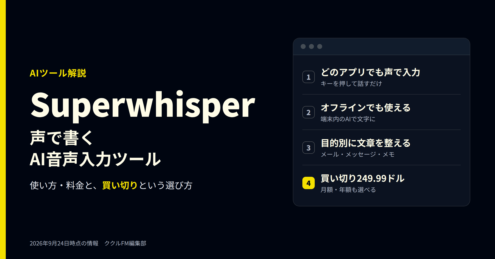
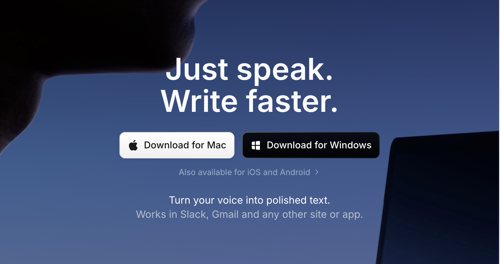
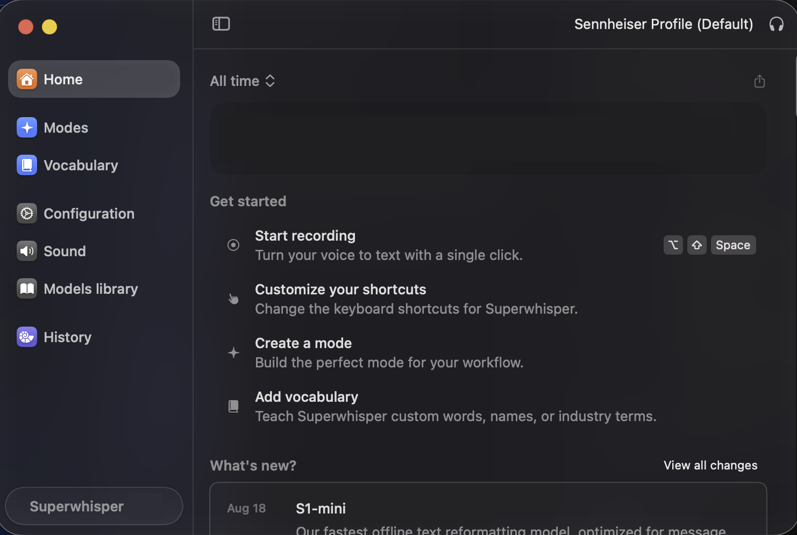
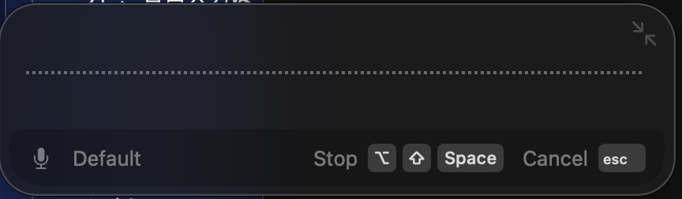
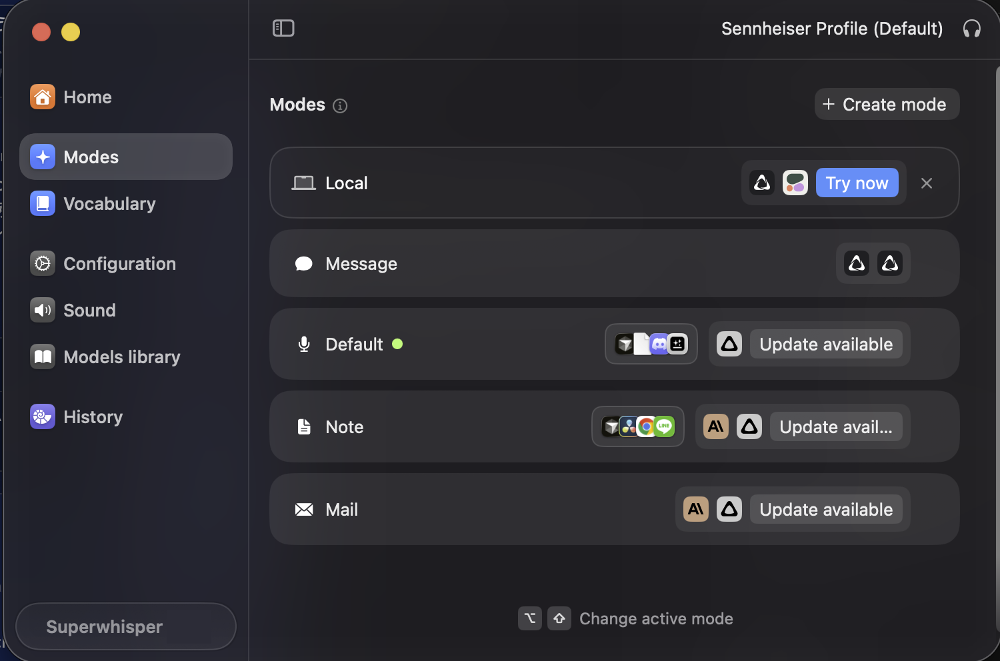
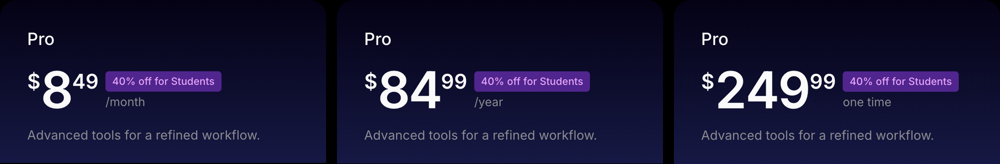
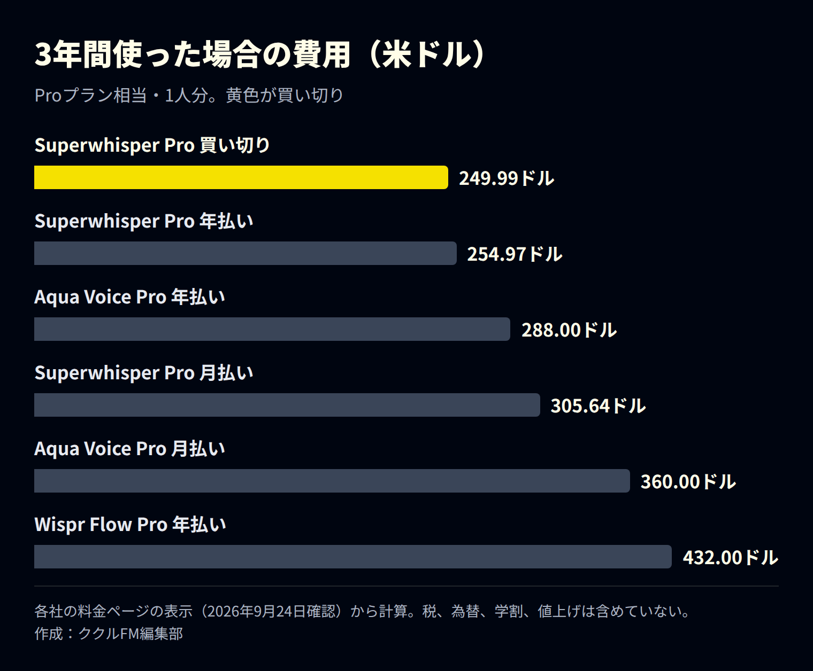

# Superwhisperとは？使い方と料金、買い切りで使えるAI音声入力ツール（2026年9月）

**公開日**: 2026.09.24  
**カテゴリ**: AIツール  
**著者**: ククルFM編集部  
**概要**: Superwhisperは、話した言葉をどのアプリにも文字で入力できるAI音声入力ツールです。使い方、目的別のモード、7〜9月の更新、料金（月額・年額・買い切り）を整理し、月額制のツールと3年間の費用を比べます。

---

「Superwhisper（スーパーウィスパー）」は、話した言葉をAIが文字にして、メールやチャット、文書など、どのアプリにも入力してくれるツールです。キーボードで打つより速く文章を書けるうえ、オフラインでも使えます。

この記事では、Superwhisperでできること、使い方、7〜9月の更新、料金を整理します。月額制の音声入力ツールが多いなか、買い切りでも使える点にも注目し、3年間の費用を比べました。情報は2026年9月24日時点です。なお、ククルFMでも、Claude CodeやCursorへの指示を声で入力するのに使っています。

※本記事はAI（Claude）の支援を受けて作成し、内容は編集部が各社の公式情報と照らし合わせて確認しています。

## 先に結論：押さえたい3つのこと

- **どのアプリでも声で入力できる**：キーを押して話すだけで、カーソルのある場所に文章が入ります。Mac、Windows、iPhone、Androidに対応しています
- **目的に合わせて文章を整えてくれる**：「メール」「メッセージ」などのモードを選ぶと、話し言葉を読みやすい文章に直してくれます
- **買い切りを選べる**：Proは月8.49ドル、年84.99ドル、買い切り249.99ドルの3通り。3年使うなら、買い切りが最も安くなります

## Superwhisperとは：話すだけで、どのアプリにも文字が入る

*Superwhisperの公式サイト（出典：Superwhisper、2026年9月24日撮影）*

Superwhisperは、音声を文字にするAIを使った入力ツールです。Slack、Gmail、Notion、Cursor、Claude Codeなど、ほとんどのアプリで使えます。主な特徴は次のとおりです。

| 特徴 | 内容 |
|---|---|
| どのアプリでも使える | カーソルのある場所に、話した内容が文字で入る |
| オフライン対応 | 端末の中のAIで文字にできる。ネットがなくても使える |
| 100以上の言語 | 日本語にも対応。Proでは他の言語から英語への翻訳もできる |
| 目的別のモード | メール、メッセージ、メモなど、目的に合わせて文章を整える |
| 辞書の登録 | 社名、人名、業界の用語を覚えさせて、変換の間違いを減らせる |
| 会議とファイル | 会議の録音と文字起こし。Proでは音声・動画ファイルの文字起こしも |

Macやスマホにも標準の音声入力がありますが、Superwhisperは、話したあとにAIが文章を整えてくれる点と、用途ごとにモードを使い分けられる点が違います。

## 使い方：キーを押して話し、もう一度押すだけ

*Superwhisperのホーム画面（2026年9月24日撮影。利用状況の表示などは加工しています）*

1. 文章を入れたい場所（メールの本文など）にカーソルを置く
2. 録音のショートカットキーを押す（画面の例では Option＋Shift＋Space）
3. 話し終えたら、もう一度同じキーを押す。文字が入力される

*録音中の表示。取り消すときはescキーを押す（2026年9月24日撮影）*

### モードで、文章の整え方を変える

*モードの一覧。モードごとに、使うAIや対象のアプリを決められる（2026年9月24日撮影）*

モードは「どう整えるか」の設定です。たとえば「Mail」ならメールの文面に、「Message」ならチャット向けの短い文にしてくれます。アプリごとに使うモードを決めておけば、切り替えの手間もいりません。整えるAIには、GPT、Claude、Geminiなども選べます。

## 2026年7〜9月の主な更新（Mac版）

| 日付 | 内容 |
|---|---|
| 8月19日 | 端末の中で動く新しいAI「S1-mini」が登場。文章の調子（丁寧・くだけた など）を調整できる |
| 8月26日 | 端末の中で動くWhisperのモデルが無料で使えるように。無料体験は3,000語に変更 |
| 9月3日 | 無音の部分を自動で取り除く機能が、標準でオンに。音声入力のあとも、コピーしていた内容が消えないように |
| 9月23日 | 会社で決めたクラウドAIの設定を守るように（自分のAPIキーを使う場合） |

## 料金：月額・年額・買い切りの3通り

*Proプランの料金。左から月払い、年払い、買い切り（出典：Superwhisper、2026年9月24日撮影）*

| プラン | 料金（米ドル） | 主な内容 |
|---|---|---|
| Free | 無料 | どのアプリでも音声入力、会議の録音、100以上の言語、Whisperモデルは無制限 |
| Pro 月払い | 月8.49ドル | Freeに加えて、クラウドと端末のAIを無制限に使える、自分のAPIキーを使える、英語への翻訳、音声・動画ファイルの文字起こし |
| Pro 年払い | 年84.99ドル | 月払いの2か月分がお得 |
| Pro 買い切り | 249.99ドル（1回だけ） | Proと同じ内容をずっと使える |
| Enterprise | 個別見積 | SOC 2 Type II認証、請求と認証の一元管理、使えるモデルの制限 |

学生は40％引き、どのプランも30日以内なら返金できます。

### 3年使うなら、買い切りが最も安い

*3年間使った場合の費用（各社の料金ページから編集部が計算）*

同じような音声入力ツールには、Aqua Voice（Pro：年払いで月8ドル、月払いで月10ドル）や、Wispr Flow（Pro：年払いで月12ドル、月払いで月15ドル）があります。どちらも月額・年額の定期払いだけで、買い切りはありません。

Superwhisperの買い切り（249.99ドル）は、月払いと比べると約2年5か月、年払いと比べると約3年で元が取れます。長く使うと決めているなら、買い切りが有利です。

ただし、機能や日本語の精度はツールごとに違います。まずは無料版で自分の声と仕事に合うかを試し、合えば買い切りを選ぶ、という順番がおすすめです。

## 使う前に知っておきたい注意点

- **専門用語は辞書に登録する**：社名、人名、業界の用語は、そのままだと別の字に変換されることがあります。よく使う言葉は辞書に登録しておきましょう
- **機密情報はオフラインで**：クラウドのAIを使うと、音声や文章が外部に送られます。顧客情報などを話すときは、端末の中だけで動くモード（Local）を選ぶと安心です
- **周りの音に気をつける**：騒がしい場所では精度が落ちます。マイク付きのイヤホンやヘッドセットを使うと安定します
- **最後は目で確認する**：数字や固有名詞は、送る前に必ず読み直してください

## まとめ

- Superwhisperは、話した言葉をどのアプリにも文字で入力できるAI音声入力ツール
- モードで、メールやチャットなど目的に合わせて文章を整えてくれる
- 8月からは、端末の中で動くWhisperのモデルが無料で使える
- Proは月8.49ドル・年84.99ドル・買い切り249.99ドル。3年使うなら買い切りが最も安い

まずは無料版で、毎日書いているメールや日報を声で入力するところから試してみてください。

ククルFMでは、現場やバックオフィスでのAI活用、Webサイト・システム制作のご相談を受け付けています。「音声入力やAIで、日報や報告書の手間を減らしたい」という段階でもご相談ください。

[お問い合わせはこちら](../../index.html#contact)

## 関連記事

- [Claude Codeの最新アップデート（2026年9月）｜Opus 5.5と非エンジニアにも使える新機能](./claude-code-2026-09.html)
- [Cursorの最新情報（2026年9月）｜SpaceX傘下での変化と料金、非エンジニアが使うときの注意点](./cursor-2026-09.html)
- [現場・バックオフィスにおけるAI活用例と、人が最終判断すべき範囲](../../insights/ai-usecases/)
