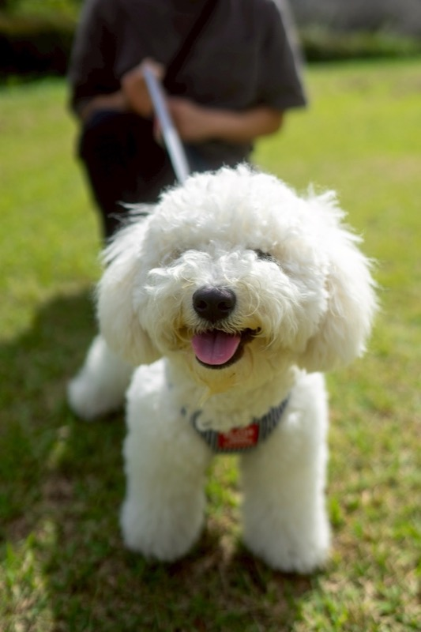

# 自宅ケアとサロンの境目：グルーミングの道具と手順

**公開日**: 2026.08.18  
**カテゴリ**: 犬関連  
**著者**: for all dogs CUCUL  
**概要**: 自宅でのブラッシングや爪切りと、サロンに任せた方がいいケアの境目をご紹介します。

---

自宅でどこまでケアしてよくて、どこからサロンに任せるべきなのか、という質問をよくいただきます。この記事では、ブラシや爪、耳、歯、シャンプーについて、私たちが実際にサロンでお願いしている境目をご紹介します。全身カットの独学や、肛門腺の処置、耳の奥の毛抜きについては書いていません。それらは医療行為に近いか、専門的な技術が必要な範囲です。店舗はfor all dogs CUCUL（群馬県桐生市相生町4丁目65-27、電話0277-54-1311）で、犬に関わる事業全体については[犬に携わる業務](../../services/dog/index.html)のページもご覧ください。

## 毎日全部やらなくていい

毎日すべてのケアをまとめてやる必要はないと思っています。ブラシか歯か爪、どれか1つで十分です。血が出た、強い臭いがする、腫れているといった様子があれば、自宅で対応を終わらせず病院に相談してください。全身カットと足裏のケアはサロンにお任せいただいています。

## 道具

使っている道具は次のとおりです。

| 道具 | 用途 | 選び方 |
|------|------|--------|
| スリッカー | もつれ | 毛の長さに合う |
| コーム | 仕上げ | 目が細かい |
| 爪切り | 爪 | 犬用。止血剤を横に置く |
| イヤークリーナーとコットン | 耳の見える範囲 | 綿棒は奥に入れない |
| 犬用歯ブラシ | 歯 | 人用の研磨剤は使わない |

このほかにあるとよいものとして、短毛用のラバーブラシ、ダブルコート用のアンダーコートブラシ、犬用ドライヤーがあります。

## 被毛の種類と頻度

被毛の種類によってブラシの頻度は変わります。

| 被毛 | 例 | ブラシ |
|------|----|--------|
| 長毛 | マルチーズ、シーズー | 毎日 |
| ダブルコート | 柴、ゴールデン | 週2〜3（換毛期は毎日） |
| 短毛 | フレブル | 週1〜2 |
| 巻き毛 | トイプードル | 毎日。もつれは根元から |

爪は月1〜2回が目安で、床でカチカチと音がするようになったら切り時です。白い爪はピンクの部分の手前2〜3mm、黒い爪は一度に少しずつ切ります。耳は週1回、見える範囲だけを目視で確認します。歯は毎日が理想ですが、最低でも週3回。シャンプーは月1〜2回で、洗いすぎないことと、お湯の温度は36〜38度、耳と目に入れないこと、生乾きのままにしないことを意識しています。

## 手順のおおまかな流れ

ブラシをかけるときは、スプレーを薄くかけてから毛流れに沿ってとかし、もつれている部分は無理に引っ張らずにコームで整えます。脇や耳の後ろ、指の間は落としやすい部分なので気をつけています。爪は明るい場所で、1日1本だけ切るのでも構いません。出血したときは止血剤を使い、翌日は切らないようにします。耳は目視してからコットンで拭き、根元を軽く揉んで、振って出てきた汚れを拭き取ります。臭いや黒い汚れ、腫れ、触ると痛がる様子があれば病院です。歯は口周りを触ることから始め、ペーストを舐めさせて、外側の歯茎の境目を優先的に磨きます。奥歯を優先し、拒否が強い日は歯磨きシートやガムで済ませて、翌日また触るようにしています。

## サロンに任せる目安

自宅でお願いしているのは、日常のブラシ、慣れている子の爪切り、見える範囲の耳の確認、歯磨き、月1回程度のシャンプーです。サロンにお任せいただきたいのは、全身カット、足裏の毛、肛門腺、耳の中の毛抜き、黒い爪、暴れて危ない爪、皮膚が赤いのに洗いたいときです。目安としては、月1回のサロンと自宅での短いケアを組み合わせるくらいがちょうどいいと思います。預かりや来店の前日については[来店・預かりの前日にやること](./trust-relationship.html)、季節ごとの病気については[季節ごとの健康管理](./seasonal-health-care.html)の記事もご覧ください。

## すぐに病院に相談したい様子

食欲が2日ない、下痢や嘔吐が続く、ぐったりしている、呼吸がおかしい、歩き方が急に変わった、皮膚が赤く腫れている、耳から強い臭いがする、といった様子が見られたときです。

## 関連

- [来店・預かりの前日にやること](./trust-relationship.html)
- [子犬を迎える前](./puppy-preparation.html)
- [季節ごとの健康管理](./seasonal-health-care.html)
- [店舗サイト](https://www.cucul-dogs.jp/)
