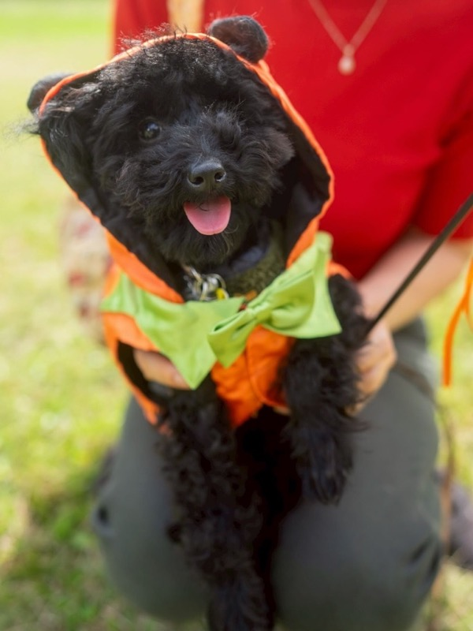

# 子犬を迎える前に準備すべきこと

**公開日**: 2026.08.18  
**カテゴリ**: 犬関連  
**著者**: for all dogs CUCUL  
**概要**: 迎える前の道具・安全・病院・家族ルールを表にし、当日は静かにする。

---

## この記事でできるようになること / やらないこと

- **できること**: 必須グッズと役割分担を、迎える1週間前までに埋める。
- **やらないこと**: 犬種の性格診断、価格の保証。販売中の子は店舗の最新情報を正とする。最終確認日: 2026-08-18

子犬の出る情報は [店舗の子犬ページ](https://www.cucul-dogs.jp/shop#a01) と [犬に携わる業務](../../services/dog/index.html)。犬種の探し方は [犬図鑑](../../services/dog/breeds/)（写真は自社分だけ。無いカードはプレースホルダ）。

## 結論

足りないのは愛ではない。**寝床、トイレ、コード類、かかりつけ、家族の禁止事項**。当日は囲まず、まず排泄と水。

## 必須グッズ（コピペして買う）

| アイテム | 用途 | 選び方 |
|---------|------|--------|
| ケージまたはサークル | 居場所 | 成犬サイズを見越す |
| クレート | 移動と寝床 | 中で回転できる |
| トイレトレーとシーツ | 排泄 | ケージ内に置ける |
| フードボウルと水入れ | 食事 | ステンレスか陶器、倒れにくい |
| 首輪またはハーネスとリード | 識別と歩行 | 子犬サイズから。リードは1.5〜2m |
| フード | 食事 | 今食べているものを確認してから変える |

あるとよい: 消臭、ウェット、噛むおもちゃ、ブランケット、ブラシ、爪切り。ケアの手順は [グルーミング](./home-grooming.html)。

## 部屋

置く場所: 人がいる部屋の隅。直射とエアコンの風を避ける。玄関と窓際は温度差が大きい。

片付ける: コード、ボタン、蓋なしゴミ箱、有毒な観葉植物、階段。ベランダの隙間。

## 家族で決めること

散歩・食事・トイレ替え・ブラシの担当。ソファ、人の食べ物、呼び名、褒め方を一致させる。不一致は子犬の問題ではなく、人のルールの問題。

## 病院

迎えて1週間以内の健診が目安。混合の履歴、寄生虫、マイクロチップ、狂犬病は生後91日以降で法律上の義務。夜間の緊急先を先に紙に書く。

## 当日と最初の1週間

移動はクレート。着いたらトイレ、水、サークル。長時間抱かない、大勢で囲まない、その日はシャンプーしない。

1〜3日は場所と食事のリズム。4〜7日で探索を少し増やす。食欲がない、下痢、隠れっぱなしが続くときは病院。来店の送り方は [来店・預かりの前日](./trust-relationship.html)。

社会化（生後3〜12週が目安）は、無理なドッグランより、人の声・掃除機・短い外出から。ワクチンプログラム中の外出範囲は獣医師の指示が正。

## 費用の幅（目安であり見積ではない）

初期: グッズ3〜5万、健診とワクチンと登録とチップでさらに数万、合計おおむね6〜10万の話が出ることが多い。毎月: フード、シーツ、おやつ、トリミングが必要な犬種で1〜3万の幅。店舗の子の代金は別。必ず見積を取る。

## 関連

- [来店・預かりの前日](./trust-relationship.html)
- [自宅ケアとサロンの境目](./home-grooming.html)
- [季節ごとの健康管理](./seasonal-health-care.html)
- [子犬情報（店舗）](https://www.cucul-dogs.jp/shop#a01)
