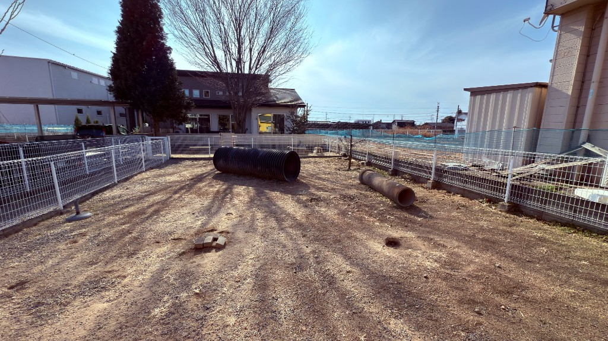

# 季節ごとの愛犬の健康管理（関東・川口〜桐生）

**公開日**: 2026.08.18  
**カテゴリ**: 犬関連  
**著者**: for all dogs CUCUL  
**概要**: 関東の気候に合わせた愛犬の健康管理と、季節ごとのサロン利用の目安をご紹介します。

---

関東といっても、川口のような内陸と海沿いでは蚊がいなくなる時期が少しずれます。この記事では、フィラリアの予防期間や、川口・桐生での暑さ寒さへの対応を月ごとに整理し、サロンに出すタイミングの目安も添えました。投薬の自己判断についてはここでは書いていません。開始月や薬の種類は、かかりつけの獣医師の判断が基準になります。サロンは[for all dogs CUCUL](https://www.cucul-dogs.jp/)（桐生市）にあり、ククルFMの事務所は川口市にあります。

## 季節ごとに気をつけていること

春はフィラリアと換毛の時期、夏は散歩の時間帯、秋は体重の変化、冬は乾燥と凍結防止剤への注意、というのが季節ごとに気をつけているポイントです。カットや足裏の状態が心配な時期は、自宅で無理せず[グルーミング](./home-grooming.html)の記事を参考にサロンに相談するのがよいと思います。

## フィラリアと狂犬病の目安

フィラリアの予防は、蚊が出始めて1ヶ月後から、いなくなって1ヶ月後までが目安とされていて、関東では4月開始から11月終了までを確認するという話をよく聞きます。開始前に検査が必要かどうかや、薬の剤型（錠剤、おやつ、注射、スポットタイプ）については病院で確認してください。狂犬病予防注射は法律上の義務で、多くの地域で春に案内が出るため、5月前後に「まだ来ていないか」と確認するようにしています。

## 関東のカレンダー

川口・桐生での目安を月ごとにまとめると、次のようになります。

| 月 | 川口・桐生で先にやること | サロンに出す目安 |
|----|--------------------------|------------------|
| 1〜2 | 乾燥、室温、室内遊び | 静電気でもつれる長毛 |
| 3 | フィラリア検査の予約、春の換毛 | 下毛が抜けきらずブラシが追いつかない |
| 4 | フィラリア開始、ノミダニ | 草むら散歩のあとの毛玉 |
| 5 | 狂犬病の確認、花粉の足拭き | 足先を舐めて赤い |
| 6〜8 | 早朝か夜の散歩。車内放置しない。地面は手の甲5秒 | 肉球まわりの毛、蒸れ、サマーカットはプロ |
| 9 | 換毛と食欲。体重 | 夏毛の残り |
| 10 | 健診、ワクチン履歴 | 秋の全身 |
| 11 | フィラリア終了月か確認、防寒の準備 | 足裏を短くして滑らないか相談 |
| 12 | 乾燥、凍結防止剤のあとの足洗い | 靴や足まわり |

## 夏、川口のアスファルトで気をつけること

犬は人のように汗で体を冷やせません。パンティングが強い、よだれが多い、ぐったりしている、吐く、歩けない、といった様子があれば、体を冷やしながら病院に向かいます。散歩の判断は気温の数字だけでなく、地面の熱で見るようにしています。手の甲を5秒つけて確認する方法がよく使われます。エアコンは、人が少し涼しく感じる程度を目安にしていますが、数値の絶対値は部屋によって変わります。応急対応としては、日陰に移動し、水で体、脇、内股を冷やします。氷水を飲ませて胃を冷やすような自己流の対応はせず、病院に連れて行っています。

## 冬、凍結防止剤に気をつける

塩化カルシウム系の凍結防止剤を舐めると危険だという注意が広く出ています。雪道を歩いたあとは足を洗うようにしています。短い散歩の代わりに室内で嗅ぐ遊びを取り入れるのもよい方法です。シニアの子は、散歩の前に関節を軽く動かしてから外に出るようにしています。

## 換毛期とサロンのタイミング

春と秋は、毎日ブラシをかけても追いつかない週があります。そういう週は、月1回のサロンを前倒ししてもよいと思います。自宅でバリカンを入れるのは、皮膚が見えている子でも失敗しやすい作業なので、カットはサロンにお任せいただいています。来店の前日の準備については[来店・預かりの前日にやること](./trust-relationship.html)の記事もご覧ください。

## 関連

- [自宅ケアとサロンの境目](./home-grooming.html)
- [来店・預かりの前日](./trust-relationship.html)
- [子犬を迎える前](./puppy-preparation.html)
- [店舗サイト](https://www.cucul-dogs.jp/)
