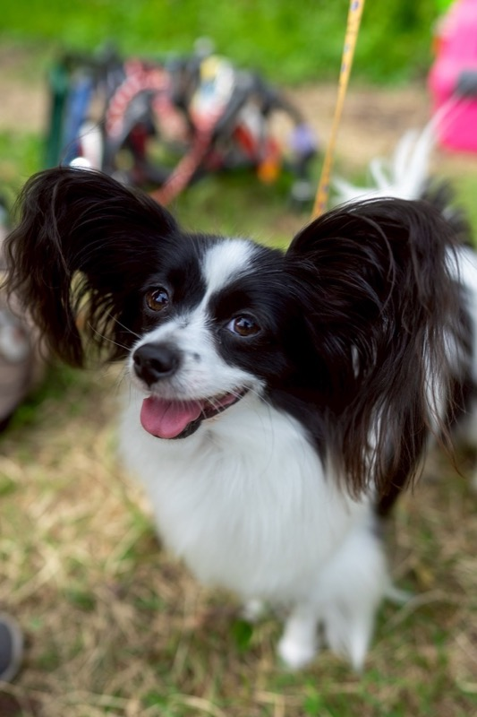

# 来店・預かりの前日にやること

**公開日**: 2026.08.18  
**カテゴリ**: 犬関連  
**著者**: for all dogs CUCUL  
**概要**: トリミングやホテル利用の前日に整えておきたいことを、サロンの現場からご紹介します。

---

トリミングやホテルの予約を入れると、前日に何を準備すればいいのか気になる方も多いと思います。この記事では、来店や預かりの前日にサロンとして実際にお願いしていることをまとめました。しつけ講座のような一般論や体罰の話、医療の判断については触れていません。ご予約や最新の注意事項は、[for all dogs CUCUL](https://www.cucul-dogs.jp/)のページと電話0277-54-1311でご確認いただけます。営業時間は10:00〜18:00、定休日は火曜と第1・第3月曜です。犬に関わる事業全体については[犬に携わる業務](../../services/dog/index.html)のページもご覧ください。

## 前日は特別なことをしない

前日にお願いしているのは、特別なことではありません。いつもと同じ食事、いつも触っている場所の確認、持っていくものの名前をはっきりさせておくことです。初めての施設で飼い主さんが焦っていると、その緊張は犬にそのまま伝わってしまいます。

## 前日に確認していただきたいこと

前日には、食事の時間と量がいつもどおりか（変更する場合はその内容）、朝の排泄ができたかどうか、ワクチンや予防の記録を持参するか店舗側で把握済みか、苦手な触れ方があるかどうか、持参するもの（フード、薬があれば薬、リード、トイレシート。好きなおもちゃは最小限で構いません）を確認しています。薬を飲んでいる日は、何時に何を飲んだかを紙に書いていただくようにお願いしています。口頭だけでは、当日忘れてしまうことがあるからです。

## 触れ方について

一貫させたいのは、家庭内のルールそのものではなく、預かっている数時間の扱い方です。頭の上から急に手をかぶせるのではなく、胸や顎の下から触るようにしています。足先を触る練習は、切らずに3秒だけ。嫌がったらそこで止めておやつを与えます。名前を呼んで目が合ったら終わりにすると、預かり中に呼びかけたときの反応が楽になります。「行かないよ」と言ってから連れて行くのはやめて、準備が見えている状態でリードを持つようにしています。家庭のソファのルールを、サロンのテーブルにそのまま持ち込むこともしません。施設には乗ってよい台と、乗らない床があります。

## 当日の朝

当日は空腹すぎも満腹すぎも避けたいので、普段どおりの量で構わないことが多いです。車に酔いやすい子は、店舗の指示を優先してください。水はいつもの場所に置いておきます。持っていくものは前夜のうちに玄関にまとめておくと、当日に家中を探して犬が興奮する、ということが減ります。初めて来店する子には、長時間の抱っこや家族総出の見送りは避けていただき、送りは短く、引き渡しの際に気になること（咬む、耳が弱い、薬があるなど）を一言伝えていただくようにしています。

## 帰ってから

その日は新しいカットを触りすぎないようにしています。足裏を初めて短く整えた子は滑りやすくなっているので、床や階段には注意してください。皮膚が赤い、耳を振る、食欲がない、といった様子が見られたら、様子を見るより先に電話でご相談いただくという判断もあります。日常のブラシについては[自宅ケアとサロンの境目](./home-grooming.html)の記事もご覧ください。

## 関連

- [自宅ケアとサロンの境目](./home-grooming.html)
- [季節ごとの健康管理](./seasonal-health-care.html)
- [子犬を迎える前](./puppy-preparation.html)
- [店舗サイト](https://www.cucul-dogs.jp/)
