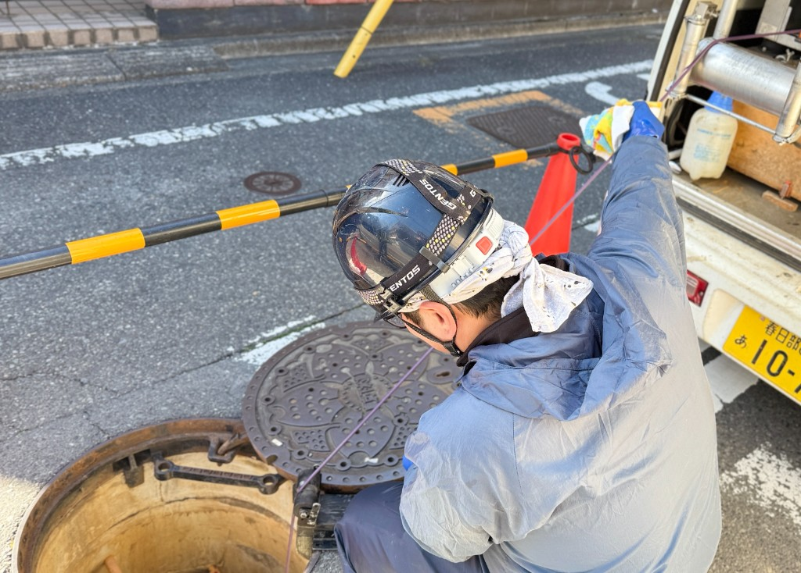

# マンホール作業の安全：酸欠・硫化水素と交通誘導

**公開日**: 2026.08.18  
**カテゴリ**: 調査・清掃  
**著者**: ククルFM編集部  
**概要**: マンホール作業の前に欠かせないガス測定と交通誘導を、法令の最低ラインと現場の実務からご紹介します。

---

マンホールの蓋を開けた瞬間、下をのぞき込みたくなる気持ちはよく分かります。ですが、そこで顔を出すのが一番危ない動きです。この記事では、入坑前に何を測り、誰を配置し、道路上をどう守るかを、法令の最低ラインに沿って整理します。救助の実技マニュアルや、資格の取得方法そのものについては触れていません。個人が無断で入坑することも前提にしていません。

基準にしているのは、酸素欠乏症等防止規則（昭和47年労働省令第42号）、労働安全衛生法、公益社団法人日本下水道協会『下水道維持管理指針』（総論編・マネジメント編など）、そして道路使用については所轄警察署の許可条件です。下水道管内やマンホールの中は、硫化水素を扱う第二種酸素欠乏危険作業になり得ます。数値や選任の条件は改訂されることがあるので、最新の条文と技能講習のテキストを確認する習慣にしています。

## 坑外から測ってから入る

私たちが徹底しているのは、坑外から測ってから入ることです。酸素18%以上、かつ硫化水素10ppm以下を保ち、監視人を置き、何かあったときに救助する人も呼吸用保護具を身につけている状態を作ります。道路の上では、許可と保安器材も作業の一部だと考えています。

## 入坑前に確認していること

現場に入る前、私たちは次のことを確認してから作業を始めます。

- 道路使用・占用の条件を現場で読み直したか
- 規制材や看板、誘導員の位置が許可どおりになっているか
- 酸素と硫化水素（必要なら可燃ガスも）を坑外から測ったか
- 作業開始前、全員が坑外に出たあとの再開前、異常が起きたときに、それぞれ測る担当が決まっているか
- 換気を止めていないか。吸気口のそばに発電機の排気を置いていないか
- 酸素18%未満、または硫化水素10ppm超なら入らず、換気か呼吸用保護具で対応する
- 空気呼吸器などの日常点検が済んでいて、救出用の器具が坑外にあるか
- 墜落制止用器具が必要な深さや条件かどうか
- 入坑者の人数と退避の合図を全員が言えるか
- 測定値、時刻、測定者を法令の期間だけ記録しているか

測定は体を乗り入れて行うのではなく、プローブやホースを差し込んで坑外から行います。

## 忘れやすい数字：18%と10ppm

作業場所の空気は酸素18%以上、第二種の作業ではさらに硫化水素10ppm以下というのが、防止規則が定める管理目標です。「少し超えても短時間ならいい」という運用はしていません。換気が技術的に難しい場合や、実際に救出するときは、空気呼吸器や酸素呼吸器、送気マスクを使います。中毒者を素手や無保護のまま引き上げると、二次災害につながります。

## 誰がどこに立つか

酸素欠乏危険作業主任者は、酸素欠乏・硫化水素危険作業主任者技能講習を修了した人の中から選任し、作業方法や測定、器具の点検、保護具の使用状況を監視する役割を担います。監視人は坑内の異常を早く見つけて地上へ通報し、退避させる役目です。特別教育を受けた人は、硫化水素の出方や症状、保護具、退避と救急そ生の知識を持っているはずで、未教育の人を坑内作業に入れることはありません。資格全体の位置づけは[資格の地図](./sewer-qualifications.html)にまとめています。

## 管内より先に、道路で人が死傷する

実は、管内の作業より先に、車や歩行者との事故で死傷することがあります。所轄の道路使用許可（必要なら占用許可も）の写しを現場に置き、規制の開始・終了時刻を守ります。夜間や雨天は視認できる色と灯火を使い、誘導員は背中を交通に向けたまま作業をしません。蓋を開けている間は、歩行者が落ちないよう囲いを設けます。許可条件が現場の状況と違うときは、作業を止めて所轄に確認するようにしています。カメラ調査の方式については[カメラ調査の方式](./sewer-camera-methods.html)で説明しています。

## 関連

- [カメラ調査の方式](./sewer-camera-methods.html)
- [損傷判定の見方](./sewer-damage-report.html)
- [資格の地図](./sewer-qualifications.html)
- [調査・清掃事業](../../services/inspection/index.html)
