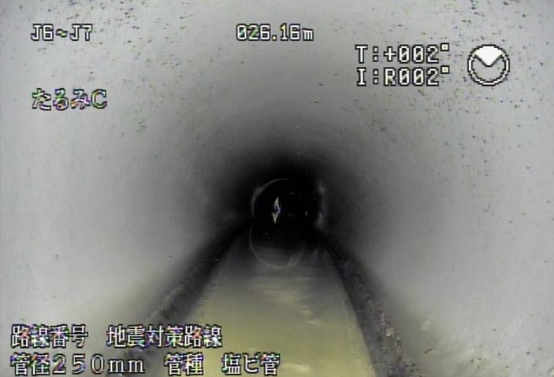

# 下水道カメラ調査の方式：ミラー・TV・取付管・押し込み

**公開日**: 2026.08.18  
**カテゴリ**: 調査・清掃  
**著者**: ククルFM編集部  
**概要**: 本管・取付管・マンホール近傍で、私たちが管路調査の現場でどう方式を選び分けているかをご紹介します。

---

下水道の管内調査には、テレビカメラ・押し込みカメラ・ミラー調査など、いくつかの方式があります。この記事では、私たちが管路調査の現場でどう使い分けているかをもとに、「どの管を、どこまで見たいか」から方式を選ぶ考え方をご紹介します。機種のカタログ比較や料金表の話は、ここではしません。

判定や記録の基準は、発注者の仕様書と、公益社団法人日本下水道協会の維持管理指針に従っています。この記事に載せている現場写真は、すべて自社の管路調査で撮影したものです。損傷の記号の読み方については、別記事の[損傷判定の見方](./sewer-damage-report.html)でまとめました。

## 画質より「どこまで入れるか」で選ぶ

方式を選ぶとき、最初に気になるのは画質かもしれません。でも実際の現場で効いてくるのは、どこまで管の中に入って、何を記録できるかです。本管のスパン全体を見るならテレビカメラ、宅地側の細い枝管なら押し込みカメラ、マンホールを開けた直後の状態確認なら鏡や管口カメラ、というのが基本の切り分けになります。

## 方式ごとの向き不向き

| 方式 | 向いている場所 | 分かること | 向かないこと |
|------|----------------|------------|--------------|
| ミラー（鏡とライト） | マンホールを開けた直後の管口付近 | 流下、堆積、管口の大きな異状 | スパン奥の定量記録 |
| テレビカメラ（本管） | マンホール間の本管 | 距離付きの映像、継手・取付管口、損傷の位置 | カメラが入らない細径・急曲 |
| アナログテレビカメラ | 同上（伝送がアナログ） | 本管の通し確認 | デジタルほど後工程の編集・保存が楽ではない |
| 取付管調査 | 本管から宅地ますまでの枝管 | 取付管口の状態、枝管内の詰まり・破損 | 本管スパン全体の診断 |
| 押し込みカメラ | 細径・曲がりが多い枝管 | 人が入れない管の映像 | 長距離の本管を距離精度高く測ること |

テレビカメラは、管の中を自走したり牽引したりしながら本管を映していく方式です。アナログというのは伝送方式の違いに過ぎないので、「アナログだから古くて使えない」ということではありません。記録や判定の仕様が発注者の指定どおりになっているかどうかのほうが、まず確認すべき点です。

## 現場でどう決めているか

実際の現場では、まずマンホールを開けて中の流れとガスの状態を見ます（入坑してよいかどうかの判断は[マンホール作業の安全](./manhole-safety.html)で詳しく書いています）。そこから、本管をスパン単位でしっかり記録に残したいならテレビカメラ、宅地内の枝管で詰まりや苦情の対応をするなら取付管調査か押し込みカメラ、という順で決めていくことが多いです。

「とりあえず全部、高精細なデジタルで撮っておこう」と考えたくなるところですが、口径や曲がりの強さ、水位の条件によっては、カメラそのものが入っていけないことがあります。水位が高い、堆積が多い、屈曲がきついというのは方式選びの問題ではなく、先に清掃するか、別日に回すかという判断の話になります。

## 発注者や住民の方への伝え方

発注者や住民の方には、「本管はマンホール間をテレビカメラで距離付きで記録し、宅地側は押し込みカメラ、マンホール際は鏡で流下を確認する、というふうに分けています」とお伝えすることが多いです。写真に写る記号の読み方は、次の記事「損傷判定の見方」で説明します。

## 関連

- [損傷判定の見方](./sewer-damage-report.html)
- [マンホール作業の安全](./manhole-safety.html)
- [資格の地図](./sewer-qualifications.html)
- [調査・清掃事業](../../services/inspection/index.html)
