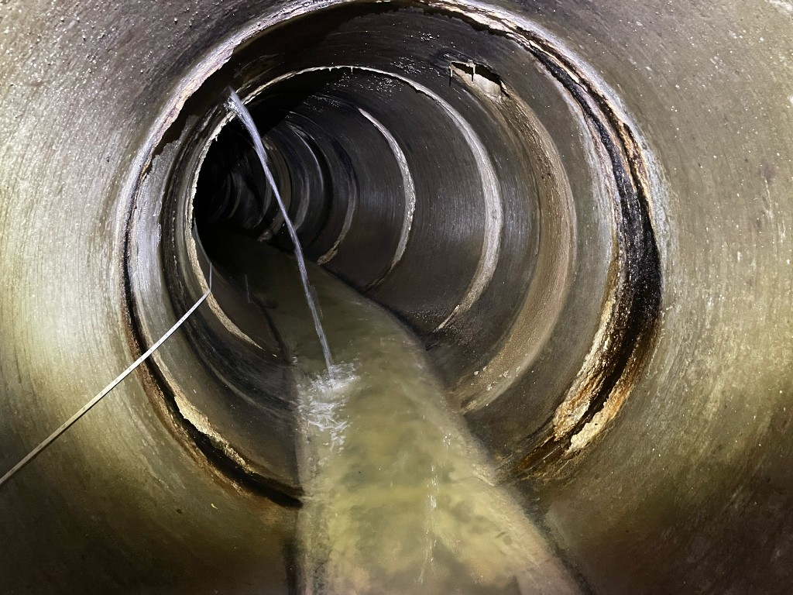

# 管路の損傷判定の見方：報告書の記号と写真

**公開日**: 2026.08.18  
**カテゴリ**: 調査・清掃  
**著者**: ククルFM編集部  
**概要**: 報告書のスパン・距離・記号・ランク・写真が対応しているかを、発注仕様を正として読み取る。

---

## この記事でできるようになること / やらないこと

- **できること**: 報告書1枚を、スパン・距離・項目・ランク・写真の5点で突き合わせる。
- **やらないこと**: 全市共通の判定表の暗記、改築の即決。記号とランクの定義は **その業務の特記仕様と発注者マニュアル** が正。最終確認日: 2026-08-18

参考になる枠組みは、国土交通省のストックマネジメント関連ガイドラインと、公益社団法人日本下水道協会の『下水道維持管理指針』です。自治体ごとに記号やランクの切り方が違うので、神戸市など他都市のマニュアルをそのまま写さない。

## 結論

ランクが悪い行＝今日直す、ではありません。まず **写真と記号が同じ場所を指しているか** を見る。緊急度は、管1本の傷ではなくマンホール間（スパン）と道路・流下への影響で決まります。

## 報告書で先に見る5欄（コピペ）

- スパン: 上流MH ＿＿ → 下流MH ＿＿
- 管種・口径: ＿＿
- 距離（起点）: 上流管口から ＿＿m。起点の取り方が仕様どおりか
- 異常項目: ＿＿（破損、クラック、継手ずれ、浸入水、取付管突出、木根、油脂、たるみ など）
- ランクと写真番号: ＿＿ / 写真No.＿＿。時計位置（例: 3時）があれば写真と一致するか

1行でも「距離はあるが写真が別スパン」「記号はあるが管口方向が逆」なら、判定の前に記録を直す。

## よく出る項目の読み方（一般）

名前は現場で通じる呼び方です。幅や円周の閾値は仕様書の表を開く。

| 項目の例 | 写真で確認すること | 誤解しやすい点 |
|----------|--------------------|----------------|
| 破損 | 欠け・開き・鉄筋の露出の有無 | ヘアクラックまで破損と書いていないか |
| クラック | 軸方向か円周方向か、連続しているか | 方向でランクが変わる仕様が多い |
| 継手ずれ | ずれ量とゴム輪の見え方 | 撮影角度で過大・過小に見える |
| 浸入水 | 滴下か噴出か、晴天時か | 取付管口の浸入を本管と二重計上していないか |
| 取付管 | 台帳にある口か、突出の有無 | 台帳に無い口を見落とす |
| 木根・油脂・堆積 | 流下を塞いでいるか | 清掃で落ちるものと構造の傷を混ぜない |
| たるみ | 始点・終点・最大深さ | カメラ姿勢の傾きをたるみとしない |

ランクは多くのマニュアルで3段階（a/b/c または A/B/C）です。**数字の意味は発注者の表が正**。他都市の数値を記憶して当てはめない。

## 緊急度との切り分け

- **管1本のランク**: その箇所の傷の大きさ
- **スパンの緊急度**: 同じ区間に傷が何本あるか、道路陥没や閉塞のリスク
- **対策**: 清掃、部分修繕、改築は、診断の次の会議。報告書の欄外に「改築確定」と書かない

住民説明では、「写真のこの位置に、仕様上この記号です。直す順番は管理者の計画です」までが調査側の範囲です。

## 受け取り側のチェック（コピペ）

- [ ] 起点マンホールが図面と一致する
- [ ] 距離の単位が m で、カメラカウンタと矛盾しない
- [ ] 各異常に写真がある（または「該当写真なし」の理由がある）
- [ ] 取付管が本管行と混線していない
- [ ] ランクの凡例が、その年度の仕様と同じ

方式の前提は [カメラ調査の方式](./sewer-camera-methods.html)。

## 関連

- [カメラ調査の方式](./sewer-camera-methods.html)
- [マンホール作業の安全](./manhole-safety.html)
- [資格試験の過去問の解き方](./sewer-exam-study.html)
- [調査・清掃事業](../../services/inspection/index.html)
