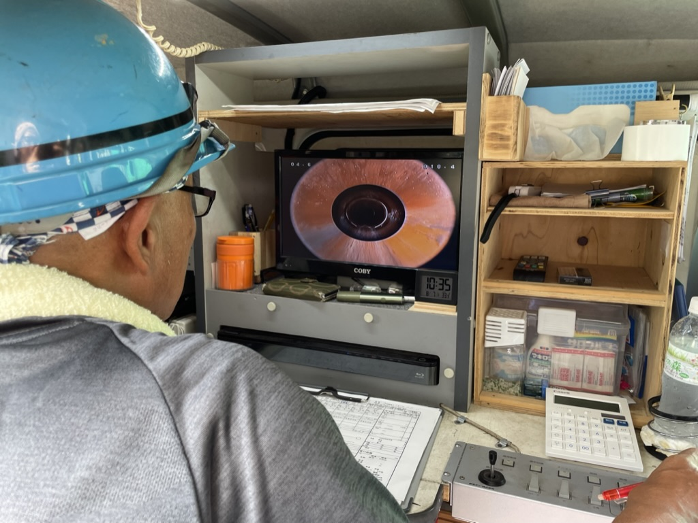

# 下水道資格試験：過去問の解き方と法規の覚え方

**公開日**: 2026.08.18  
**カテゴリ**: 調査・清掃  
**著者**: ククルFM編集部  
**概要**: 管路協の過去問と法規を、現場の実務と結びつけながら覚える私たちのやり方をご紹介します。

---

下水道の資格試験を受けようとすると、まず過去問を何年分も印刷して、全部を暗記しようとしてしまいがちです。私たちが実際にやっているのは、量をこなすことよりも、間違えた選択肢だけを残していく方法です。この記事では、その過去問の回し方と、法規の覚え方をご紹介します。予想問題の販売や、合格点の断言はしていません。問題と正答は、実施団体が公開している分を基準にしています。

管路協の過去問は公式ページの[過去の試験問題と正答](https://www.jascoma.com/system/certificate/past/exam_past_r7.html)で公開されていて、年度ごとにページが差し替わります。JSの[技術検定・認定試験](https://www.jswa.go.jp/kentei/)も同様に公式ページにありますが、合格点は事前公表しないとFAQにあります。どの資格を受けるかまだ決めていない方は、先に[資格の地図](./sewer-qualifications.html)を読んでいただくと整理しやすいと思います。

## 量より、誤った選択肢を残す

私たちが意識しているのは、量より誤った選択肢を残すことです。法規は条文を暗唱するのではなく、「事業者／作業主任者／労働者」のどれが主語になっているかを先に書き出します。そして、実務で見ている写真と、報告書の記号を、同じ週に1回だけ結びつけるようにしています。

## 過去問の回し方

過去問は次のような順番で回しています。

1. 年度を1つに固定する（最新の公開年を使う）
2. 同じ問題を、翌日に選択肢の順番を見ずに復唱しようとはしない。ノートに書いた1行だけを見返す
3. 正解した問題は捨てて、不正解だったものと「自信なく正解した」ものだけを残す
4. 濃度や年限、登録の有効期間のような数字問題は表にしないと忘れるので、公式の数字だけをそのまま書き写す

管路協の専門技士は筆記に加えて実技もある、と案内されています。実技は過去問のPDFだけでは足りないので、所属している機械を使って、操作前点検を声に出して通す練習をしています。

## 法規の覚え方

条文は最初から最後まで読み込むのではなく、1条文につき次の4点だけを確認しています。主語（誰に義務があるか）、禁止か実施義務か、数字（%、ppm、年）、そして例外があるかどうか（換気が困難なときは保護具を使う、など）です。マンホール作業に関する条文であれば、[安全記事](./manhole-safety.html)のチェック項目と、防止規則の測定・換気・選任の内容を同じ紙に書き出しています。下水道法や労働安全衛生法の罰則を暗記するよりも、現場で昨日やった手順と条文が対応しているかどうかのほうが、点数に結びつくと感じています。JS認定（管路施設）は多肢選択で、工場排水・維持管理・安全管理・法規が範囲に入るという年度案内がありますが、範囲表はその年度の受験案内を基準にしています。

## やってはいけない勉強のしかた

- 他都市の判定表を、全国共通だと思って覚えてしまう（判定の話は[損傷判定の見方](./sewer-damage-report.html)で書いています）
- 管路協が公表している合格率の累計を、自分の受ける年度の合格点だと思い込む
- 更新講習を「取ったあとの話」と先送りする。登録には有効期間があります

## 試験当日の持ち物で気をつけていること

受験票と顔写真は案内どおりの条件で用意し、公式の受験案内は電子データだけでなく印刷したものも持っていきます。会場によっては電子のみ不可の場合があるためです。実務で使っている記号表を持ち込めるかどうかは、案内で確認してからにしています。勝手に持ち込むことはしません。

## 関連

- [資格の地図](./sewer-qualifications.html)
- [損傷判定の見方](./sewer-damage-report.html)
- [マンホール作業の安全](./manhole-safety.html)
- [調査・清掃事業](../../services/inspection/index.html)
