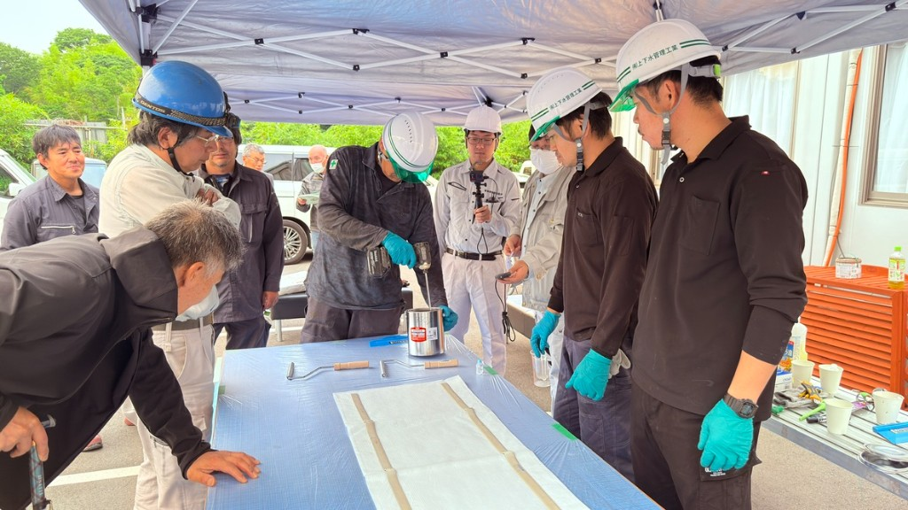

# 下水道の資格の地図：管理技術認定と管路管理技士

**公開日**: 2026.08.18  
**カテゴリ**: 調査・清掃  
**著者**: ククルFM編集部  
**概要**: 下水道管路の仕事に関わる資格を、JS・管路協・酸欠作業主任者の違いから整理します。

---

「管路管理技士」と「管理技術認定」、名前が似ていて何が違うのか分からない、という質問をよく受けます。この記事では、下水道管路の仕事に関わる資格を実施団体ごとに整理して、自分の役割ならまず何を受けるべきかを考える材料にしていただきたいと思います。合格を請け負うものではなく、受験料や日程を保証するものでもありません。日程や受験資格、免除の条件は、それぞれの公式ページが基準です。

まず団体を混ぜないことが大切です。地方共同法人の日本下水道事業団（JS）は下水道技術検定と下水道管理技術認定試験（管路施設）を実施しています。公益社団法人日本下水道管路管理業協会（管路協）は下水道管路管理技士（総合／主任／専門）を実施しています。公益社団法人日本下水道協会は指針や規格を発行する側で、これらの試験を実施している団体ではありません。酸素欠乏・硫化水素危険作業主任者は、労働安全衛生法上の技能講習です。

## まず何を受けるか

現場でカメラや清掃を担当しているなら、まず目指すのは管路協の専門技士（調査または清掃）と、酸欠の作業主任者だと考えています。計画や入札の技術者欄を書く立場になったら、JSの認定試験（管路施設）と管路協の主任・総合技士を、公式の受験資格表で確認しながら進めることになります。

## 資格の地図

| 資格 | 実施 | 何のため | 現場での使い方 |
|------|------|----------|----------------|
| 下水道管理技術認定試験（管路施設） | [JS](https://www.jswa.go.jp/kentei/) | 管路の維持管理の技術力をJSが認定 | 法令上「これがないと作業できない」資格ではない。管路協の総合・主任の受験資格に使われる |
| 下水道技術検定（第1〜3種） | JS | 計画・設計・施工などの技術者 | 管路維持の入口というより、工事・計画側 |
| 下水道管路管理専門技士（清掃／調査／修繕・改築） | [管路協](https://www.jascoma.com/system/certificate/) | 機械選定、指示、成果の報告 | 調査班は調査部門。清掃班は清掃部門 |
| 下水道管路管理主任技士 | 管路協 | 計画書・報告書、専門技士への指示 | 現場のとりまとめ |
| 下水道管路管理総合技士 | 管路協 | 維持管理計画、安全衛生の指導 | 人数は少ない。高度な判断 |
| 酸素欠乏・硫化水素危険作業主任者 | 技能講習（登録教習機関） | マンホール・管内作業の選任 | 測定と換気の指揮。[安全記事](./manhole-safety.html) |

管路協のページを見ると、試験・登録・5年ごとの更新講習がセットになっていることが分かります。更新をしないと登録が消えてしまいます。国土交通省の「公共工事に関する調査及び設計等の品質確保に資する技術者資格」には、総合技士・主任技士・専門技士（調査部門）が登録されている、と管路協が案内しています。番号や対象業務については、[管路協の認定制度ページ](https://www.jascoma.com/system/certificate/)を基準にしています。

## JS認定試験で押さえておきたいこと

JSのFAQで説明されているのは、認定試験（管路施設）は国家試験ではなく、法律に基づき国土交通大臣の認可を受けてJSが実施している試験だという点です。合格点は事前に公表されていません。令和8年度の実施案内では、認定試験（管路施設）は全国10都市で多肢選択という形が示されていますが、実施日と手数料は毎年変わるので、申し込み前に[受験案内](https://www.jswa.go.jp/kentei/goannai.html)を開くようにしています。総合技士・主任技士を受ける人は、JS認定（管路施設）の合格が受験資格になる、とJSのFAQと管路協側の案内の両方に書かれています。免除の有無も年度ごとに確認が必要です。

## 専門技士から始める人へ

管路協は専門技士について、案内の上では3年以上の部門の実務経験を求めています。証明書類が揃うまでは申し込まないようにしています。過去問は管路協が公開していて、その解き方については別記事の[過去問の解き方](./sewer-exam-study.html)にまとめました。申込時期の目安としては、管路協の制度ページによると、毎年4月に受験申込があり、7〜9月に試験が行われますが、これも年度によって動きます。

## 関連

- [資格試験の過去問の解き方](./sewer-exam-study.html)
- [マンホール作業の安全](./manhole-safety.html)
- [カメラ調査の方式](./sewer-camera-methods.html)
- [調査・清掃事業](../../services/inspection/index.html)
