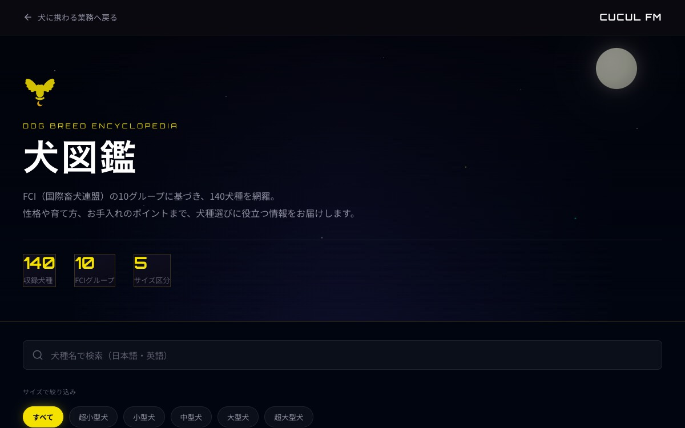

# カタログUI：検索とフィルタを先に、写真は揃ったものだけ

**公開日**: 2026.08.20  
**カテゴリ**: Web  
**著者**: ククルFM編集部  
**概要**: 図鑑は検索1欄と軸2つを先に固定する。写真が無いカードはプレースホルダのまま。外部のランダム画像は使わない。

---

## この記事でできるようになること / やらないこと

- **できること**: 今日、カタログの検索欄とフィルタ軸を紙に書き、写真が無いカードの扱いを1行で決める。
- **やらないこと**: 130種の撮り下ろし計画の代行、外部APIを図鑑写真にする。例は [犬図鑑](../../services/dog/breeds/)。最終確認日: 2026-08-20

施工LPの写真の置き方は [施工LP](./pet-floor-lp.html)。コーポレートの領域は [先に決めること](./corporate-site-decisions.html)。

## 結論

カタログで先に決めるのはデザインではない。**何で探すか** と **写真が無い日に嘘をつかないか**。CUCULの犬図鑑は、日本語・英語の検索、サイズ、FCIグループの3つ。Dog CEO のランダム写真は外した。自社で撮れた犬種（いまはパピヨン）だけ実写。残りはカードのプレースホルダ。

量（140種）はフィルタのテストデータであって、写真の完成度ではない。

## 探す軸（コピペ）

検索: ＿＿（例: 和名と英名）  
フィルタ1: ＿＿（例: サイズ 5段 + すべて）  
フィルタ2: ＿＿（例: グループ 10 + すべて）  
写真が無いカード: 出さない / プレースホルダのまま出す  
外部のランダム画像: 使わない

ゼロ件のときは「該当なし」と、条件を変える一文。空のグリッドにしない。

## カードに載せるもの / 載せないもの

載せる: 名前、英名、原産、性格タグ3、運動量・手入れ・しつけの目安。  
載せない: その場しのぎの他サイト写真、価格、在庫。販売中の子犬は [店舗](https://www.cucul-dogs.jp/shop#a01) が正。

詳細ページは同じ ID でフィルタを引き継がなくてよい。戻るリンクは図鑑トップ。

## チェック

- [ ] 検索1つ、フィルタは2軸まで
- [ ] モバイルでフィルタが開閉できる
- [ ] 写真マップはローカルパスだけ
- [ ] プレースホルダの文言が「準備中」だと分かる
- [ ] 店舗の子犬情報と図鑑を混同しない一文がある

## 関連

- [犬図鑑](../../services/dog/breeds/)
- [子犬を迎える前](../dog/puppy-preparation.html)
- [Web・3D 事業](../../services/web/index.html)
