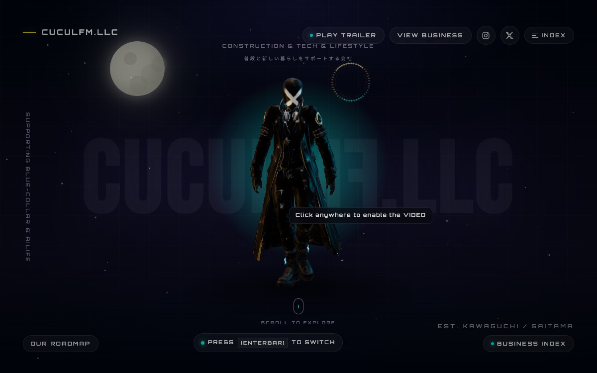

# コーポレートサイトで先に決めること（7領域の例）

**公開日**: 2026.08.19  
**カテゴリ**: Web  
**著者**: ククルFM編集部  
**概要**: ページを増やす前に、事業の数・トップに出さないもの・問い合わせ先を1枚で固定する。

---

## この記事でできるようになること / やらないこと

- **できること**: 自社サイトの「領域一覧」を7行以内で書き、トップに載せないものを1つ決める。
- **やらないこと**: SEOの一般論、WordPress設定、他社の事例の代筆。料金・納期の保証。最終確認日: 2026-08-19

例は本サイトの [事業一覧（#business）](../../index.html#business)。制作の入口は [ホームページ制作・3D](../../services/web/index.html)。

## 結論

先に決めるのは色ではない。**何の会社か、何を今はやらないか、電話とフォームはどこか**。ページ数を先に決めると、薄い下層が増える。

## 決定シート（コピペ）

会社の一言: ＿＿  
領域の数: ＿＿（本サイトは7）  
トップに出す領域: ＿＿  
トップに出さない・休眠: ＿＿  
各領域の着地: 1ページ / 下層を切る  
問い合わせ: 電話 ＿＿　フォームは ＿＿  
公開してよい実績: ＿＿（許可がないクライアントは書かない）

## 本サイトで先に固定した7つ

| No | 領域 | トップでの扱い |
|----|------|----------------|
| 01 | AI | 全事業の共通。学習記事は準備できた本だけ |
| 02 | 建設 | サービス頁は残す。実績が薄いブログは出さない |
| 03 | 調査・清掃 | 主軸は管路。雨樋などは二次 |
| 04 | 工具・クラフト | 準備中でもカードはある。商品記事はまだ書かない |
| 05 | 映像・資料 | 所持機材だけ小出し |
| 06 | Web・3D | このページ。下層を増やさない |
| 07 | 犬 | 店舗と世話記事。床LP・図鑑は事業側に残し、Web実績にはまだ載せない |

「何でもやります」をトップに書くと、どれも信頼されない。7は多いが、**カードの順序と一文で主従を付ける**（本サイトは AI を feat. にしている）。

## トップに載せない判断

- 許可のないクライアント名
- 作り途中のLPを「制作実績」にすること
- 休眠事業の詳細な投資話
- ブログの薄い一般論（リニューアルのコツ、SEOの基本）

載せないものは削除ではなく、**リンクしない・サイトマップに載せない**でも足りることがある。問い合わせは残す。

## ページの切り方

コーポレートは「トップ + 領域ごとに1枚」が先。ブログは、読者が明日使う手順があるものだけ。本サイトの Web 事業は下層を切らず、[サービス頁](../../services/web/index.html) を厚くしている。

3Dの見せ方（落ちたときの代替含む）は [トップの3Dはどう組んでいるか](./top-3d-intent.html)。

## 関連

- [トップの3Dはどう組んでいるか](./top-3d-intent.html)
- [Web・3D事業](../../services/web/index.html)
- [公式トップ](../../index.html)
