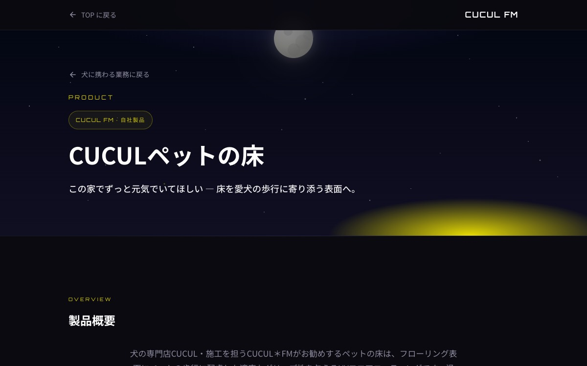

# 施工LP：写真の順番と問い合わせを先に置く

**公開日**: 2026.08.20  
**カテゴリ**: Web  
**著者**: ククルFM編集部  
**概要**: 施工LPは星空の使い回しをやめ、Before/After → 工程写真 → 見積の順にする。電話は同じ番号のまま。

---

## この記事でできるようになること / やらないこと

- **できること**: 今日、施工LPのブロック順と「写真が無いときの扱い」を1枚に書く。
- **やらないこと**: テンプレ販売、他社施工の盗用、料金の保証。例は自社の [ペットの床](../../services/dog/pet-floor/index.html)。最終確認日: 2026-08-20

コーポレートの領域分けは [先に決めること](./corporate-site-decisions.html)。検索カタログは [犬図鑑のUI](./breed-catalog-ui.html)。

## 結論

施工LPで先に決めるのはキャッチコピーではない。**人が判断できる写真が何枚あるか** と、**見積の入口が何回スクロール目か**。星空ヒーローを全事業で使い回すと、商品ページに見えない。CUCULはタイトルの「ぺット」も直し、汎用の星を消してパピヨンと床の写真を置いた。

## ブロック順（コピペ）

1. 何の製品か（1行）と、見積へのジャンプ
2. Before / After（同じアングル。無いならこの枠を出さない）
3. 工程写真（工程名を alt に書く）
4. 流れ（日数の上限を書く。保証しない）
5. よくある質問（効果の数字は「目安・個体差」）
6. 問い合わせ（電話は本サイトと同じ）

写真が無い枠は SVG のプレースホルダで埋めない。枠を消す。

## 問い合わせ

置き場所: ヒーローに1つ、末尾に1つ。文言は「無料お見積り・現地調査」。別番号をLPだけに作らない。

本サイトの電話: 090-6262-3842。店舗（桐生）の話と混ぜない。床は施工、サロンは [for all dogs CUCUL](https://www.cucul-dogs.jp/)。

## チェック

- [ ] タイトルと H1 の表記が同じ（ペット）
- [ ] 他事業の星空を消した、または写真が前面
- [ ] Before/After が実写
- [ ] 工程にファイル名コメントがあり、差し替えできる
- [ ] 見積 CTA が2箇所以内で同じ着地

## 関連

- [ペットの床 LP](../../services/dog/pet-floor/index.html)
- [Web・3D 事業](../../services/web/index.html)
- [トップの3D](./top-3d-intent.html)
