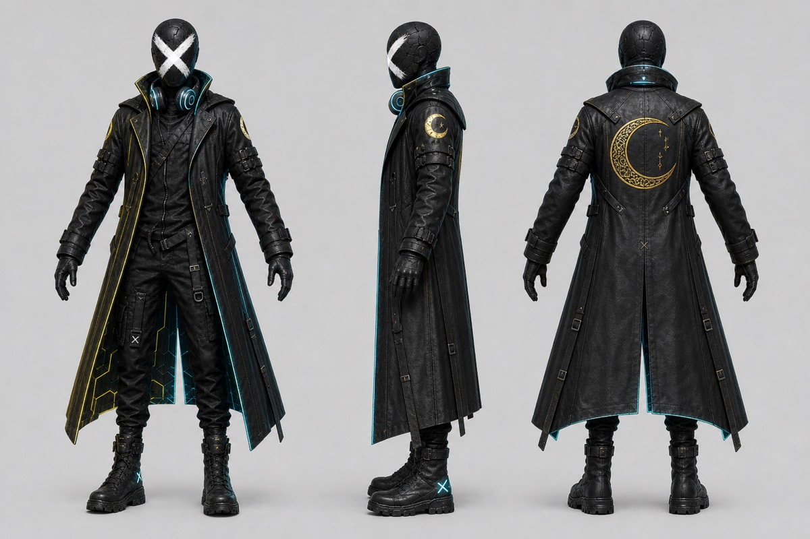

# トップの3Dはどう組んでいるか（演出の意図）

**公開日**: 2026.08.19  
**カテゴリ**: Web  
**著者**: ククルFM編集部  
**概要**: ロゴ由来のキャラをGLBで載せ、失敗時はSVGが残るようにする。操作確認はビューアで分ける。

---

## この記事でできるようになること / やらないこと

- **できること**: 「いつも動く3D」と「落ちても読めるサイト」を分けて発注・自作のチェックにする。
- **やらないこと**: Three.jsの導入手順の全コピー、モデルデータの再配布。画面の数値は実装が正。最終確認日: 2026-08-19

見る場所:

- 本番のトップ: [cucul-fm.com](../../index.html)
- モデルを回して確認する箱: [ファントムDJ ビューア](../../character-design/phantom-dj/viewer.html)
- 事業の説明: [Web・3D](../../services/web/index.html)

ライブラリ名は Three.js（ESM）と GSAP / ScrollTrigger。モデルは GLB。仕様の正は公式ドキュメント。

## 結論

トップの3Dは装飾ではない。**ロゴの人物を、会社の顔として置く**。ただし WebGL が落ちても、事業一覧と電話は残す。ビューアは検証用、トップは物語用、と役割を分ける。

## 役割の切り分け（コピペ）

| 画面 | 目的 | 失敗したとき |
|------|------|----------------|
| トップヒーロー | スクロールに合わせてキャラが物語に入る | SVGの胸像が残る。`?nochar3d=1` でも同じ |
| ビューア | 形状・マテリアルを回して確認する | トップの本文には影響しない |
| 事業カード | 7領域へ送る | 3Dと無関係。先に読む |

「全部をトップに埋め込む」と、検証のたびに本番が壊れる。モデルの確認はビューア。

## 意図（なぜGLBか）

ネオン・ファントムDJは、顔のないロゴ人物を全身にしたキャラクターです。コートのネオンと金の三日月はロゴの色。トップでは、読み込み中にローダーを出し、使える環境では canvas を SVG の上に重ねます。SVGはレイアウトの箱を渡し続ける、という組み立てです。

スクロール演出は GSAP。呼吸の動きと、拡大の動きはラッパーを分け、同じ transform を奪い合わないようにしています。ピン留めの区間では、キャラを全画面側へ移してタイムラインを見せます。

優先順位の目安（実装コメントの要約）:

1. フレーム連番があるときはそれを優先し得る
2. GLB の3Dタイムライン
3. SVG

ローカルでファイルを直接開く（`file://`）と GLB と HDRI が読めないことがあります。確認はローカルサーバー。本番と同じく HTTPS で配信する。

## 落とす判断

次を満たしたら、3Dを諦めてSVGのまま公開してよい。

- 旧ブラウザで import map が使えない
- GLB の読み込み失敗
- 利用者が `prefers-reduced-motion: reduce`（動きをほぼ止める）
- 明示的に `?nochar3d=1`

動きを止めても、**事業7枚と問い合わせは残る**のが合格です。3Dが本体になると、会社サイトとして落ちる。

## 発注・自作のチェック（コピペ）

- [ ] 3Dなしでも顔（ロゴかイラスト）がある
- [ ] モデル確認用の別URLがある
- [ ] 容量と読み込みの待ちをローダーで説明している
- [ ] スマホでキャラとボタンが重ならない
- [ ] クライアント案件は許可が出るまでトップに出さない

領域の決め方は [コーポレートで先に決めること](./corporate-site-decisions.html)。

## 関連

- [コーポレートサイトで先に決めること](./corporate-site-decisions.html)
- [3Dビューア](../../character-design/phantom-dj/viewer.html)
- [Web・3D事業](../../services/web/index.html)
